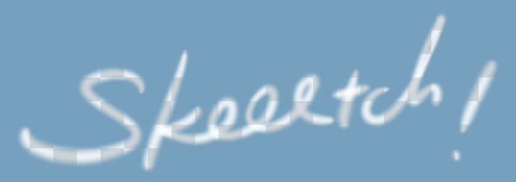
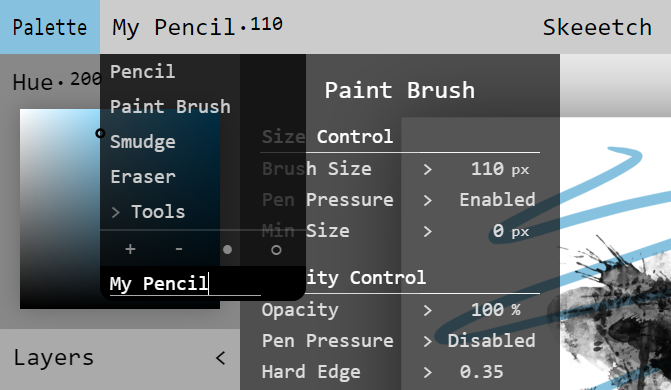

# Brush

Skeeetch provides several default brushes. You may also customize brushes based on the templates.

Click the **Brush Button** (showing current brush and size) to expand/fold the brush menu.

## Default Brushes

### Pencil

Pencil is the simplest brush for drawing a line.

There are several parameters controlling the style of pencil. The first one is its **size** (in pixel), which shows on the brush menu button, and the first value item in the brush menu. Drag/scroll/input the value will change the overall pencil size. If you want to control the size with pen pressure, you need to enable "Pen Pressure", and set the "Min Size" value.

Another property is the opacity, from 0% (fully transparent) to 100% (opaque). You can also control it with pen pressure by enabling "Pen Pressure" and "Min Opacity" under the Opacity Control section.

> Opacity 100%, 75%, 50%, and 25% pencil effect.

**Hard Edge** option controls the hardness of the brush tip edges, from 0 (blurry) to 1 (sharp).

In the Stylus Control section, Sensitivity controls the sensitivity (0~2) of the brush tip parameters changing with the actual pen pressure. The default is 1.0 (linear). The higher the sensitivity value, the harder it is to get the brush tip changing with pen pressure.

Smoothness value (-5~10) is used for stabilize the stroke to avoid jitters cause by hand trembling. The larger the value, the more smooth the curve is, but the lag behind the cursor will also increase. 0 means no stabilization. This value can be also negative, which will exaggerate the jitters.

### Paint brush

The paint brush simulates a watercolor/oil paint brush which will smudge colors around while adding its own color, just like a pencil with inertia.

> Several paint brushes with various parameters, painted using the **same** palette color.

Alongside the parameters of a pencil, pain brush owns an **extension** value. This color controls the amount of color the brush will absorb and smudge around. The extension value interacts with the opacity value, which produces a wide range of effects.

 

> The effect of smudging when changing brush tip opacity (left) or extension (right).

### Smudge

Smudge brush is used for smudging **patterns** on the paper around.

The extension value of the smudge brush controls the amount of existing pattern to be smudged around: 0% means no smudging (just like a pencil), and 100% means smudge the pattern all the way down. You may also control the intensity of smudging by pen pressure (enable pen pressure in Opacity Control section).

> Effects of 100%, 80%, and 50% extension.

Smudge brush can also carry a color, controlled by opacity value.

### Eraser

Eraser is almost a pencil, while it clears existing colors on the paper.

For a unlocked layer, the eraser will turn the stroked part transparent. For an opacity-locked layer, the eraser is equal to a white pencil.

## Anti-Aliasing

You can enable/disable the brush tip anti-aliasing from Setting > Display > Anti-Aliasing switch. See chapter [System Settings (ZH)](./system.md).

## Tools

Click on Tools button in the brush selector to expand the accessories. These tools are not brushes, but functional buttons in the brush selector menu.

### Color to opacity

Skeeetch can turn an opaque image into a transparent one, based on the color value. This is useful when trying to color a pen/pencil sketch which has a light background.

> You may also use ["Multiply" blend mode](./layers.md#blendmode) on the sketch for filling colors.

> Left: there is a white background on the imported new layer. Right: use Color > Opa to cancel the white background color.

Click on the "Color > Opa" button will cancel the white portion of the colors in the current layer. Notice that if the current layer is locked/opacity-locked, or is located in a locked/opacity-locked group, this function will not apply. The color tp opacity function is also inapplicable to a group.

## Customized Brushes

(At current, you can only customize the parameters. There will be a customized brush tip pattern function in the future.)

There are two buttons `+` and `-` at the bottom of the brush selector menu. Click on `+` to generate a copy of the current brush. You may modify the parameters of the new brush without affecting the original one. All customized brushes will be saved in the browser for further use.

> Create a new brush called My Pencil, and set its Hard Edge to 0.35.

Click on the name of the customized brush to rename it. Click on `-` button to delete the selected customized brush.
