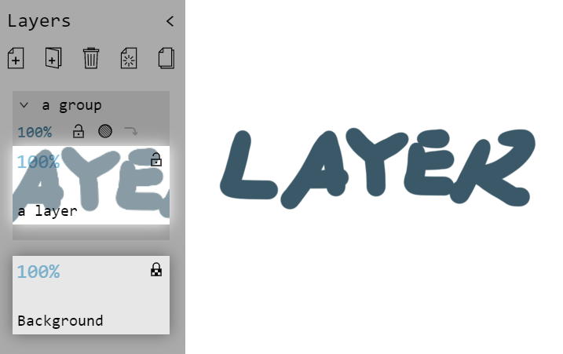
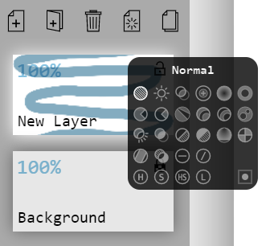
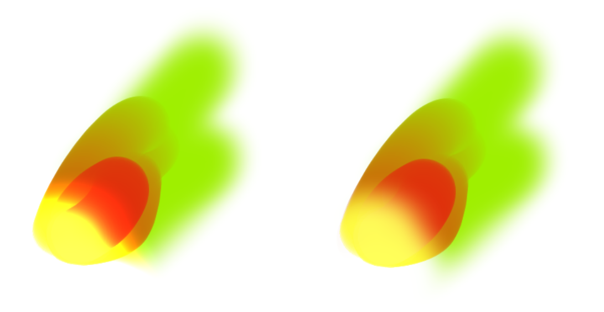
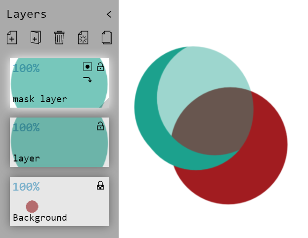
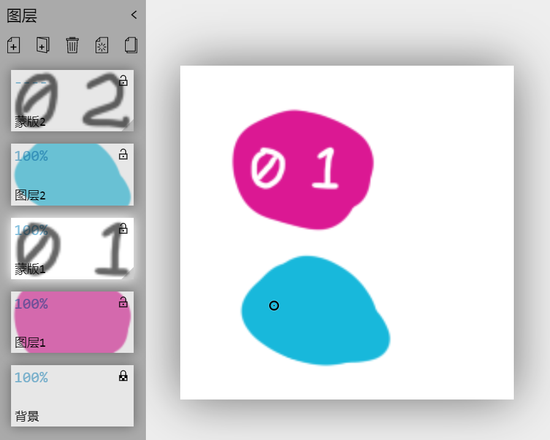
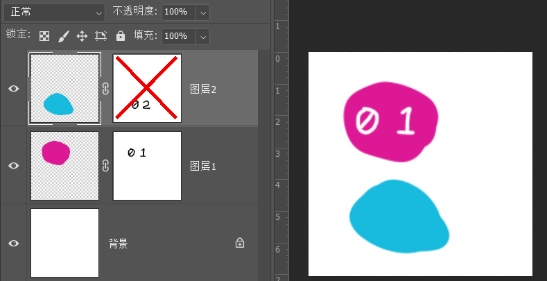
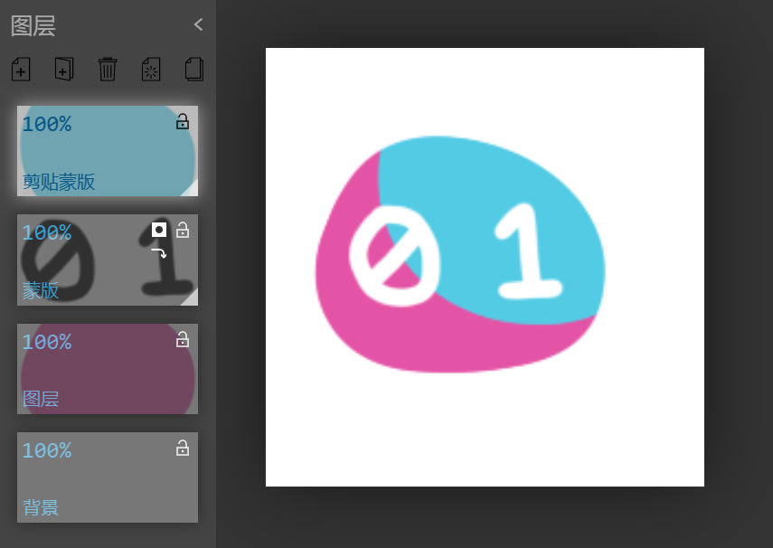
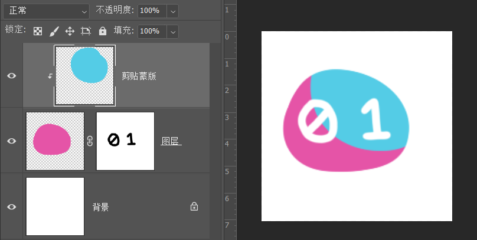
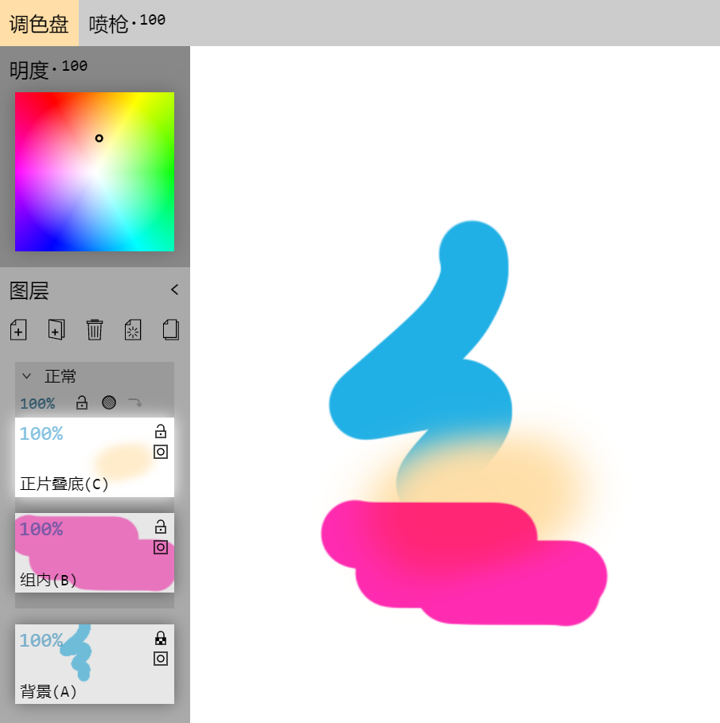
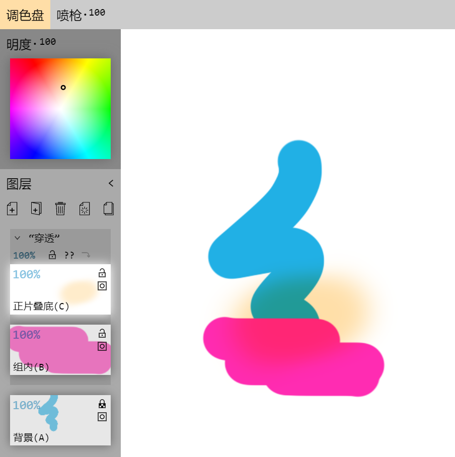

# 图层

Skeeetch支持图层和图层组的管理。图层的操作界面位于主界面左侧的**图层**选项卡，分为顶部的按钮和下方的图层列表两部分。

图层按面板顶部右侧有`<`按钮，可以用于切换图层栏的展开/收缩。收缩后的图层栏将只显示每个图层小的缩略图。

每个图层的背景是这个图层内容的**缩略图**。当缩略图尺寸大于图层图标时，在图层图标上移动光标可以浏览缩略图的不同部分。

> 图层面板按钮、两个图层、和一个图层组

## 增删图层

默认打开Skeeetch时的第一个图层是一个白色的背景图层。

点击图层面板按钮**新建**一个图层。你可以在图层名处输入来给新图层**重命名**。

点击某个图层的图标，图层图标会**点亮**指示当前绘制的对象是这个图层。

点击图层面板按钮将当前活动的图层**删除**。

在图层列表内图标过多时右侧会出现滚动条，可以拖动滚动条或在图层列表上滚动来上下浏览所有图层。

## 增删图层组

点击图层面板按钮**新建**一个图层组。图层组自身上不可绘制任何内容，但可以包含其他图层或图层组。你可以在图层组名处输入来给新图层组**重命名**。

点击某个图层组的图标，图层组的展开按钮`>`会**点亮**指示当前操作的对象是这个图层组。

点击图层组的展开按钮`>`可以在**展开/折叠**显示图层组内容之间切换。

点击图层面板按钮将当前活动的图层组**删除**。

## 改变图层顺序

按下一个图层/图层组的图标并在图层列表中**拖动**可以调整图层的顺序。你可以改变图层的前后顺序，将一个图层/图层组拖入或拖出某个图层组的列表。

## 图层属性

在图层标志左上角的不透明度百分比处输入数值、光标左右拖动、或滚动鼠标滚轮可以调节图层的**不透明度**。从0%到100%的值对应完全透明到完全显示。在数值上单击可以**隐藏/显示**图层。隐藏的图层不透明度将显示为`----`。隐藏的图层将无法绘制，也无法移动。如果希望用键盘输入数值，可以右键或Shift+单击来激活输入框。

图层标志的右上角有几个按钮。最右上的是**锁定**按钮。点击它可以在解锁、锁定不透明度、锁定之间切换。锁定不透明度后图层像素的不透明度将不会改变，也无法移动。锁定后图层的任何像素将无法改变，只能改变隐藏/显示状态、剪贴蒙版、和编辑图层名。

图层按钮中靠左上的是**混合模式**按钮。点击以打开混合模式选择菜单。详见[混合模式](#混合模式)章节。

左下角的按钮是**剪贴蒙版**按钮，点击以切换剪贴蒙版状态。剪贴蒙板图层或图层组的右下角将显示一个灰色的三角标志。剪贴蒙版图层只显示其下方普通图层的不透明部分对应的内容。图层列表/图层组最下方的内容如果是剪贴蒙版，则视为普通内容（因为没有蒙版在任何内容上）。

> 注：某些绘画软件不支持图层剪贴蒙版，因此导出的`.psd`文件在不同软件中打开会有效果差异。

图层组也有类似的属性，可以在图层组面板中点击对应的按钮来调整。注意：图层组的锁定按钮状态对其下属的所有图层/图层组均有效。

## 清空图层

当某个图层被选定时，图层面板中将出现按钮。点击此按钮将这个图层所有内容清空。注意已锁定（显示）的图层是无法清空的。对于透明度锁定（显示）的图层，清空操作将为所有像素填充白色而不改变其透明度。

## 合并图层组

当某个图层组被选定时，图层面板中将出现按钮。点击此按钮将这个图层组所有内容合并为一个图层，并取代原图层组的位置。

## 复制图层/图层组

当某个图层或图层组被选定时，点击按钮可以制作当前选定内容的副本。副本中将保留原图层/图层组所有的图层结构，内容和设置。

## 混合模式

Skeeetch支持常见的26种混合模式（已实现22种），以及一个额外的蒙版模式。默认情况下图层或图层组都是正常混合模式，并在图标上显示这个按钮。点击图层或图层组的混合模式按钮可以打开混合模式选择菜单：

菜单中每个图标对应一种混合模式，可以将光标移动到相应的图标上查看文字信息，点击以切换到该混合模式。图标与Photoshop标准的混合模式的对应列表如下：

| 正常 | 滤色 | 正片叠底 | 叠加 | 柔光 | 强光 |
| ------------------------------------------------------------ | ------------------------------------------------------------ | ------------------------------------------------------------ | ------------------------------------------------------------ | ------------------------------------------------------------ | ------------------------------------------------------------ |
| 线性减淡 | 线性加深 | 线性光 | 颜色减淡 | 颜色加深 | 亮光 |
| 变亮 | 变暗 | 浅色 | 深色 | 点光 | 实色混合 |
| 差值 | 排除 | 减去 | 划分 |                                                              |                                                              |
| 色相° | 饱和度° | 颜色° | 明度° |                                                              | 图层蒙版 |

> °：功能未完善

**透明度混合**

对于带有透明度的图层，一般有两种透明度混合模式：强度和填充。强度模式下像素透明度会影响混合的强弱，而填充模式下透明度只影响混合结果的透明度而不影响混合效果强度，对比会强烈一些。Photoshop默认使用强度模式，需要为图层取消“透明形状图层”来使用填充模式。SAI默认使用填充模式。

> 颜色减淡模式的效果，使用填充混合（左）和强度混合（右）

在Skeeetch中可以设置全局的透明度混合模式：在 *设置* > *渲染器* > *透明度混合* 开关中可以选择**混合强度**（强度模式）或**中性色填充**（填充模式）。注意：对大文件，切换这个选项可能会比较耗时。

Skeeetch中支持填充模式的混合模式有线性减淡、线性加深、线性光、颜色减淡、颜色加深、亮光、差值共七种。（Photoshop的“实色混合”模式由于没有中性色，并不属于Skeeetch中性色填充的作用范围）

**关于图层组特殊模式：蒙版**

Skeeetch中没有为图层设置单独的蒙版图层。取而代之的是一个蒙版混合模式。当一个图层放在另一个图层上方，该图层的混合模式为蒙版，且开启了剪贴蒙版属性时，这个图层就表现得像一般的蒙版图层一样。

> 蒙版图层中的深灰色圆形将下方的蓝色圆形的一部分变得半透明了。

在混合模式菜单中选择蒙版，会同时自动添加剪贴蒙版。

蒙版是通过一个图层的亮度改变另一个图层的透明度的方式。蒙版图层中一个地方颜色越深，相应被蒙版图层的区域就会变得越透明。

Skeeetch支持从`.psd`文件中加载蒙版，以及保存蒙版到`.psd`文件。未显示的蒙版在Photoshop中显示为禁用。

 ➔  

> Skeeetch（左）和Photoshop（右）中蒙版图层的对应关系

如果同时有蒙版和剪贴蒙版，则剪贴蒙版应放置在蒙版上方。

 ➔  

> Skeeetch（左）和Photoshop（右）中蒙版和剪贴蒙版的对应关系

最后，由于Skeeetch中的蒙版默认颜色均为白色，所以在加载`.psd`文件中其他默认颜色的蒙版时会出现效果不一致的情况。

**关于图层组特殊模式：穿透**

很多像素绘图软件中为图层组实现了“穿透”混合模式。严格来说穿透不是一种混合模式，而是指示以一种新的先后顺序来组合已有的图层。

一个正常混合模式的图层组会将组内预先混合，然后作为整体参与其相邻图层的混合，组内图层的混合模式**不会影响到组外的混合**；而具有穿透属性的图层组就像其内容没有装在这个图层组里面一样，和其相邻图层也自下而上地混合。对于正常混合模式的图层内容来说这是无关紧要的：正常模式图层的混合结果与混合的结合顺序无关（即A+(B+C)=(A+B)+C）。这种区别会显示在组内图层具有其他混合模式的时候，它们一般是对结合顺序的变化敏感的：

 

> 假设存在“穿透模式”，相比正常模式（左），穿透组中的正片叠底图层C的**效果穿透出了组**，也作用到了背景图层A上，相当于直接将B和C移出图层组放到A的上方。此时A+穿透(B+C)=(A+B)+C≠A+(B+C)。这种现象在Photoshop中也可以看到：合并一个穿透模式的组可能导致显示效果发生改变。

在Skeeetch中，出于对图层组功能的定义以及运行性能的考量（具有穿透模式的组在渲染时性能极难优化），**并没有实现穿透模式**。一个Skeeetch图层组的内容就等于其所有内容之和，图层组相对其他组外内容也是独立不变的。这也导致打开`.psd`文件时，如果图层组具有穿透模式（Photoshop默认），则打开后的显示效果和在其他软件中打开**可能会出现区别**。

好在这**不是一个大问题**，因为这种区别仅出现在：图层组内有特殊混合模式的内容，且这个内容作用在了图层组外的区域上。因此，具有普通混合模式内容的组，或者组内特殊混合模式内容使用了剪贴蒙版（限制了作用区域），或者组内的底色为不透明色，或者具有特殊混合模式的内容都直接位于图层列表里（没有套在组内），或者…… 都不会出现差异。总之，如果出现了因穿透模式导致的显示差别，可以将具有特殊效果的图层**从组内拖移出来**，即可恢复正常。

