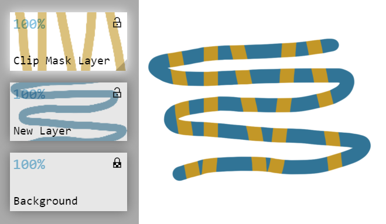
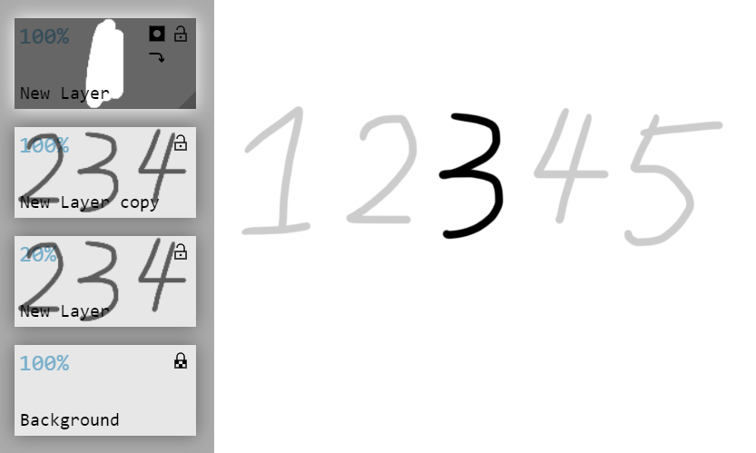

# Layers

One of the powerful tools in Skeeetch is the full support of layers and groups. The layer panel is on the left under the palette, and contains layer buttons & layer icons.

There is a `<` button at the top-right corner of the layer panel. Click it to expand or shrink the layer panel.

The background of each layer is its thumbnail image. When the thumbnail is larger than the layer icon, move the mouse around the icon to see hidden parts of the thumbnail.

> The layer panel buttons (5 of them), a layer, a group containing the layer, and a background layer whose opacity is locked.

## Addition & Deletion

The default layer is a white background layer and a transparent new layer.

Click on the  button to add a new layer to the paper. You can rename the layer by clicking on the name.

Click on the icon of a layer to activate it. The icon will light up to show that you are treating this layer as the working target.

Click on the  button to delete the activated layer. Note that you cannot delete a layer when it is the only layer in the panel.

If there are too many icons, there will be a slider on the right (or left, if changed the [UI Orientation](./system.md#uilayout)). Drag the slider to scroll on the layer panel to surf along all layers.

## Addition & Deletion of Group

Click on  button to create a group. The group is like a folder - it doesn't have its own content, but contains other layers or groups. You can also rename the group or activate it (`>` button lights up).

Click on the `>` button to expand/fold the contents of this group.

Click on the  button to delete the activated group.

## Reorder the Layers / Groups

Drag the icon of layers or group and drop it to a new place to reorder them. You can swap the icon with its siblings, drag an icon into or out of a group.

## Layer Properties

On the icon of a layer or group, there is a percentage showing the overall opacity of this layer. 0% means transparent and 100% means opaque. You may drag, scroll, or enter a value (need to right click or `Shift`+left click on the value) to change the opacity. You may also left click on the value to show/hide the layer. The value shows as `----` when the layer is hidden. Hidden layers cannot be modified, but can be reordered or deleted.

The upper-right button con a layer icon is the **lock** button. Click on it to switch among unlocked , opacity-locked , and locked  status. The alpha value (opacity) of each pixel in an opacity-locked layer cannot be modified. The opacity-locked layer also cannot be moved. It only accepts modification on layer opacity (overall) and other layer properties. A locked layer does not accept any change except layer name, clip-mask status, or reordering.

The button on the left of lock button is the **blend mode** button. See the [blend mode](#blendmode) section.

The button  below is the clip mask button. Click it to toggle the clip mask status of this layer. When clip mask is enabled, there will be a grayish triangle on the right bottom corner of this layer icon. A clip mask clips out its master layer's contents (the first non-clip mask layer beneath it) by its pixel opacity. The effect seems like drawing on a opacity-locked layer.

> Notice: when exporting as a `.psd` file, certain software doesn't support a group as a clip mask.

A group has similar properties of a layer. You can adjust the properties in the similar way.

## Clear Layer

Click on the  button (or use keyboard shortcut `Delete`) to clear all contents in the current layer. Notice that you cannot clear the contents of a locked layer. Clearing an opacity-locked layer will fill all the pixels white while preserving its pixel opacity.

## Merge Group

Click on the  button to merge all the contents of a group as a layer. The new layer will replace the original group.

## Duplication

Click on the  to make a copy of the current selected layer or group. The copy will preserve all the properties / layer structures of the original one.

## Blend Mode

Skeeetch supports 26 commonly used blend modes (22 of them supported at present), and two extra modes for masking. The default blend mode is the normal mode , click on the blend mode icon to call out the blend mode selector:

Each icon in the blend mode selector represents a blend mode. Hover the cursor above the icon to see its name, and click on it to set it as the blend mode of this layer. The icons and the corresponding blend modes are listed as follows:

|                                                              |                                                              |                                                              |                                                              |                                                              |                                                              |
| ------------------------------------------------------------ | ------------------------------------------------------------ | ------------------------------------------------------------ | ------------------------------------------------------------ | ------------------------------------------------------------ | ------------------------------------------------------------ |
| Normal | Screen | Multiply | Overlay | Soft Light | Hard Light |
| Linear Dodge | Linear Burn | Linear Light | Color Dodge | Color Burn | Vivid Light |
| Lighten | Darken | Lighter Color | Darker Color | Pin Light | Hard Mix |
| Difference | Exclusion | Subtract | Divide |                                                              |                                                              |
| Hue° | Saturation° | Color° | Luminosity° |                                                              | Mask Black Mask |

> °: Blend mode not implemented yet.

**Opacity Blend Algorithm**

As for a layer with transparency, there are two algorithms to blend the colors: blend effect intensity follows (Intensity mode) or doesn't follow (Neutral Color mode) the opacity of pixels. The Neutral Color mode will generally shows a stronger color contrast than the Intensity mode.

> The effect of color dodge mode, with neutral color blend (left) or intensity blend (right)

You may change the global blend algorithm at Settings > Renderer > Opacity Blend option.

Among all the blend modes, the algorithm will affect layers with linear dodge , linear burn , linear light , color dodge , color burn , vivid light , and difference mode.

**Mask and Black Mask**

Skeeetch doesn't have a stand-along mask option for a layer or group. Instead, Skeeetch implemented a mask blend mode. When a layer is set as mask blend mode  over another layer, with a clip mask  property, this layer acts as the mask of the underneath layer.

> The mask layer above the layer makes the contents of layer kind of transparent.

When you select the mask blend mode, it will also enable clip mask mode. Mask provides a way to change the transparency of another layer by the color in this layer. The darker the color in the mask layer, the more transparent the masked layer will be.

Skeeetch also supports exporting a mask layer to the `.psd` file. invisible mask layer will be shown as disable in Photoshop.

 ➔  

> The mask layer statuses in Skeeetch and Photoshop

If there is a mask layer and a clip mask layer at the same time, the clip mask should be positioned above the mask.

 ➔  

The mask blend mode suggests that the default color of this layer is white (doesn't change the transparency of its master layer). When you want to start from a fully hidden layer, click on the mask blend mode icon again to switch it to a black mask , which has a default color of fully black.

> Use a black mask to select part out of a layer. The original layer is adjusted half-opaque to highlight the selected part.

