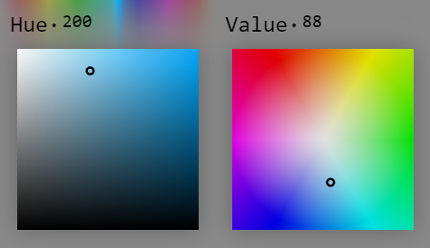
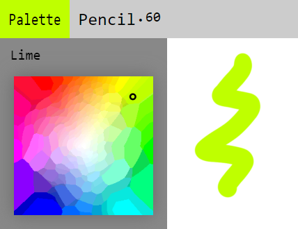

# Palette

The palette is the widget that manages color in Skeeetch. It is located at the top-left of the UI, and can be expanded/folded by clicking on the **Palette** button.

There are two parts in the palette menu: the slider at the top, and the selector at the rest of the part. The slider is visible only when you move the mouse near the slider area.

## Types of Palette

Skeeetch supports H-SV (Hue-Saturation/Value) and V-HS (Value-Hue/Saturation) palettes. You may change the style via Settings > Palette > Color Selector option.

> The representations of a same color under H-SV (left) and V-HS (right) selectors.

You may select a color by clicking and dragging on the slider or the selector. When you choose a color, the Palette button will turn into that color.

When selecting a color, there will be a hint above the slider suggesting the information of the selected color. The default information is the hue (0~360, H-SV) or value (0~100, V-HS) number. You can switch the type of information from Settings > Palette > Color Info option, and the hint will show the information closest to the current color. Available information types are:

* Web Safe Color: the hexadecimal representation of the current color, and the web safe color area in the selector.
* Web Named Color: closest named color entities in Web.
* Pantone Color: closest Pantone color code.
* Named Color: closest color with a name under current language setting.

> V-HS palette with named color information

## Picking Color from the Paper

Use right click or `Alt`+left click. Please refer to [Picking Color](./system.md#colorpicker).

## Picking Color in Palette

The selector shows the area of the **closest** color to the current color, but this might not be the exact color corresponding to that information. To select that precise color, use right click or `Alt`+left click on the selector just like picking color on the paper.