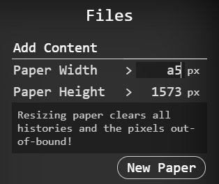

# Files and Repository

Skeeetch supports a series of operations on files. These operations are accessible through the Files menu on the upper-right corner. 

## Add Content

There are two input items on the first Add Content section, controlling the width and height of the paper. You may input value/drag/scroll on it to change the width and height (in pixel) of the paper. Skeeetch also offers a crop-window dragger to manipulate the paper size, which will show up when you click on the width or height value:

Dragging the corners, edges, or the inner part of the crop window will also change the width and height values.

> Function key combination
>
> | Key     | Drag Corner             | Drag Edge |
> | ------- | ----------------------- | --------- |
> | None    | free                    | free      |
> | `Shift` | keep width-height ratio | free      |
> | `Ctrl`  | pan                     | pan       |
> | `Alt`   | free                    | free      |
>
> Dragging the inner part with `Shift` key will pan the whole paper as usual. Otherwise, it always pans the selected area.

You may also enter a standard paper code like "A4" or "b5" in the width/height input. In this way, you will get a paper of that size with 300 points per inch (ppi).

> Trying to create a horizontal A5 paper. Enter the code in the height input area will generate a vertical paper.

> Skeeetch supports at most 5600×5600 pixels, and at least 16×16.
>

## New Paper

Click on the New Paper button to create a new blank paper based on the current size in the width/height input. Change the **filename** (initially Skeeetch) at the center-top of the title.

## Change Size (extend or crop)

After you specified a size by either the width/height input area or the crop selector, you may hit Change Size button to **change the size** of the current paper. The area within the new size will be preserved.

## Open File

Skeeetch supports open regular image files like `.bmp/.jpg/.png/.tiff`, and `.psd` layered image file. You may simply drag the file into the window, or click the Open File button to select one.

> If you drag an image on to the paper, Skeeetch generates a new **layer** for this image. If you drag it on to the Files menu, Skeeetch generates a new **file**.

> If you try to open a `.psd` file with unsupported contents, such as an adjustment layer, a text layer, or HDR contents, there will be hints in the Task Report panel on the Settings menu panel. Click on each message to locate the unsupported layer.

> If you are trying to open a file too large for Skeeetch, that may extort too much resource from the system, the UI may die out with a hint in the Settings menu panel. Follow the hint to see what you can do to improve the performance.

## Save File in Browser

Skeeetch supports automatically saving your works until next visit. If you don't need the automatic saving, turn the option Files > Save Content > Auto Save as Off. If you need a manual save request, you may click on Files > Save Content > Save in Repository, or use the shortcut `Ctrl+S`.

All files are save in the **repository**. Click on a file to open and continue working on in.

> Only after you open a file can you rename it! (by the filename block at the center of the title)

## Save as New File

Click Files > Save Content > Save as New File to create a copy of your current work, and then open this copy. If you disabled Auto Save, the changes on the original file will not be saved to it.

This function acts as an archive, where you may save stages of your work as different copies.

## Delete a File

In the repository, each file icon carries a small trash can icon on the upper-right side. Click that icon to delete the file.

> CLICK THAT ICON!

The currently opened file could not be deleted.

## Front Stage & Back Stage Tasks

As you may have noticed, when performing tasks, Skeeetch shows a round indicator at the bottom-left side of the paper. There are two kinds of tasks in Skeeetch: front stage and back stage tasks, indicated as orange or blue.

**Front stage tasks** are tasks with the highest priority, such as opening a file, exporting a file, or loading saved items. It's hard to operate user instructions while performing these tasks.

**Back stage tasks** are tasks with low priority, and can run in the background, such as cleaning caches, or automatic savings, although in certain cases back stage tasks might also freeze the UI.

When there is no task performing, you may exit Skeeetch safely. If you try to close or refresh the page while there is a task running, Skeeetch will prompt you to wait until it finishes. A force quit may result in content lost or storage error.

## Cancel Front Stage Task

When Skeeetch is performing a front stage task, you may manually request an abort by clicking on the × in the indicator:

Skeeetch will try to cancel the task as soon as possible.

> Front stage tasks are generally essential tasks. Cancelling these tasks may cause the outcome to be incomplete.

## Export a File

Click on Files > Save as PNG to save the paper as a PNG image with opacity information.

> At present only supports PNG image. Well, not a bad thing...

Click on Files > Save as PSD (or use the shortcut `Ctrl+Shift+S`) to export the paper as a `.psd` file that can be used in other kinds of CG software. Skeeetch will try to maintain all possible options in the file, but if there are some issues found during exporting, there will be a message in the Settings > Task Report panel telling which layer may cause a problem.

## Clipboard

Skeeetch supports `Ctrl+X` (cut), `Ctrl+C` (copy), and `Ctrl+V` (paste) shortcuts. You can copy/paste the activated layer from/to Skeeetch itself, or other software or webpages*.

> \* Sometimes the copy/paste will discard the alpha channel of the image

If you try to copy and paste a group with Skeeetch, only the combined result of this group will be pasted, and the structure within this group will not be copied. Use the button to copy a group with its inner structures. (see the [layer duplication](./layers.md#duplication) section)

If you try to cut a locked layer, the action will be the same as copy.

Meanwhile, Skeeetch supports `Ctrl+Space+C` shortcut to copy the whole image on the paper into the clipboard, and `Ctrl+Space+V` shortcut to **paste and replace** the contents of the current layer (not group).

