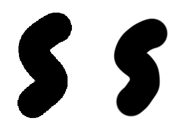
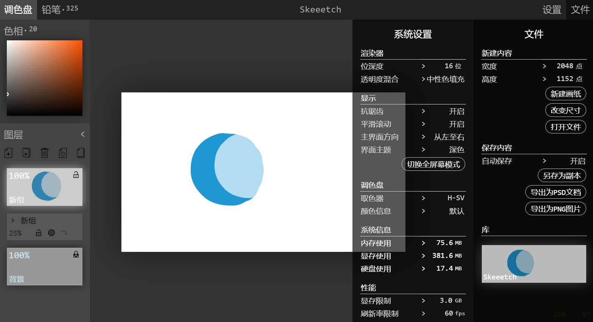
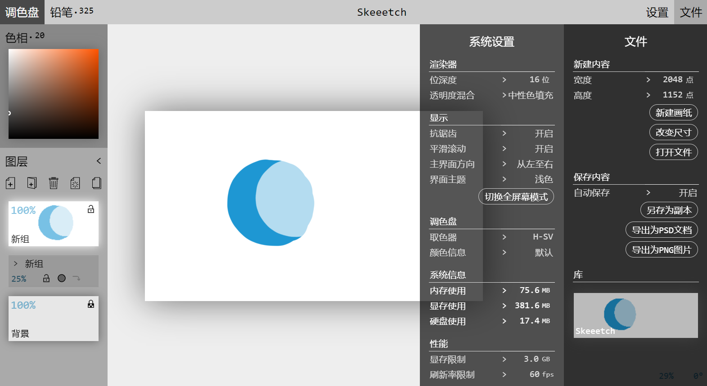

# Paper and System

This chapter describes the operations on paper settings and system settings. They mainly locate in the **Setting** menu.

Most settings in the menu will be saved automatically after you change them.

## Paper

### Draw something

Use the left button of the mouse/touch pad/pen to draw lines on the paper. Please refer to the [Brush](./brush.md) chapter.

 ### Color picker

Use the right click or `Alt`+Left click to pick a color from the paper and load it to the palette. The color picked is what you see on the paper.

### Paper position

#### Zoom

Change the value of **zoom** (in percentage) to change the position of the paper. You can drag the value, scroll on the value, or input the value by keyboard to change it. You may also scroll on the canvas area (or drag up & down with two fingers on a touchpad) to zoom in/out.

#### Rotate

Press `Shift` while scrolling on the canvas area to rotate the paper. You can also change the value of  **rotate** (in degrees clockwise) by dragging the value, scrolling on the value, or entering the value by keyboard. If you press `Shift` while scrolling on the **rotate** value, it rounds to the multiples of 5 degrees.

You can also rotate the paper by dragging the paper with right mouse button while pressing `Shift` key. When the paper is positioned near a horizontal/vertical direction, it will be attracted to that direction.

#### Pan

Press `Shift` while dragging the paper will **move** the paper horizontally/vertically. You can see a "moving" cross shaped mouse cursor. It is also possible to move the paper by dragging on the touchpad around with two fingers while pressing `Ctrl` key, or scrolling on the paper while pressing `Ctrl` key.

#### Flip

Click the `⇆` button on the bottom-right corner will **flip** the paper horizontally. This is only a flip of the view, NOT the actual contents in the paper.

#### Reset

**Reset paper position** by clicking on the `[•]` button.

### Pan a layer or group

When you select a layer/group as active, press `Ctrl` key and drag on the paper to move only this layer/group. The cursor will turn into an arrow.

**Notice**: if the layer/group is locked/opacity locked, or it is within/contains a locked layer/group, you cannot pan this layer/group.

### Undo and redo

Skeeetch supports undo and redo actions to surf through the drawing history. You can click the `<<` or `>>` button to undo/redo one step, or to use the hotkey `Ctrl+z` for undo, and `Ctrl+Shift+z` or `Ctrl+y` to redo. If you're using a mouse, clicking previous/next key has the same effect.

> Old history actions will be discarded. The steps of history depends on the RAM strategy and the system configurations.

## System Settings

Skeeetch can be configured in the **Settings** menu. The following contents introduce the items in the Setting menu.

### Bit depth

Bit depth specifies how many bits are used to represent one color channel of one pixel. Possible values are `8 bit` (byte), `16 bit` (half float), or `32 bit` (float). The higher the bit depth, the more precise the color will be rendered. However, a higher bit depth also means taking up more VRAM/RAM resources. 32 bits are needed to guarantee very precise color/alpha channel rendering, but the exact bit depth to use depends on the requirements of your task.

### Opacity blend

This item specifies the algorithm for alpha channel blending. Please refer to [blend modes](./layers.md#blendmode)。

### Anti-aliasing

Anti-aliasing (AA) applies to both the paper display and the brush rendering. When you turn off AA, the rendering is performed point-to-point, which may cause unpleasant edges when drawing (left).

If you enable AA (right), Skeeetch will perform interpolation algorithms to smooth the edges (right), which may be a performance bottleneck in extreme cases. If you are drawing pixel arts, turn off AA to get the sharpest pixels.

### Transform animation

Skeeetch will play a smooth transition animation when you adjust the position of the paper. If you are not fond of such a sluggish effect, or such an effect causes lags during your use, turn off transform animation in this setting item.

### UI layout

You can toggle UI layout to decide whether you want the layer panel to be on the left or right of the window.

### Color theme

Skeeetch has two internal themes: light and dark. Choose the UI style you like with this setting.

 

> Dark theme (left) & light theme (right)

### Toggle fullscreen

Click on **Toggle Fullscreen** button to enter/exit fullscreen mode. You may also use the fullscreen shortcut (often F11 key).

> Not all browser support fullscreen.

### Palette settings

Please refer to [Palette (ZH)](./palette.md)。

### Language

At present there's no option for language setting. You may change language by url param "lang=xxx".

https://iraka-c.github.io/Skeeetch/gl/index.html?lang=en English version

https://iraka-c.github.io/Skeeetch/gl/index.html?lang=zh Simplified Chinese version

> Other languages? You can help us by contributing to [Skeeetch Language Options](https://github.com/Iraka-C/Skeeetch/tree/master/gl/javascripts/languages) !

## Performance

### VRAM limit

This option allows you to specify how much VRAM (approx.) Skeeetch may use.

Skeeetch needs at least 1~2GB of VRAM to operate. Of course, the more the better. Check your graphics card to set the VRAM limit. If you are using integrated graphics processor (no discrete graphics card), the VRAM is shared with CPU RAM.

> You have to enter with keyboard! This option does not support drag or scroll.

### FPS limit

You may limit the highest refresh rate (fps) of Skeeetch here.

Less fps means less computation/system resource consumption and less input lagging, but may also lead to display flickering. This option limits the **display** refresh rate, rather than the input sampling rate.

### Developers

**Draw layer border**

Draw the borders of `GLTexture` and valid texture area borders.

### Information 

These rows show system resource consumptions of Skeeetch.

**RAM** shows the RAM taken up by history operations and buffered layer contents.

**VRAM** shows the VRAM amount used by renderer.

**Drive** shows the hard drive amount used by storing images in the repository.

The above are estimate values. The actual usage may differ according to the policies of OS/browser/graphics driver.

Skeeetch supports 4GB of memory an VRAM.
