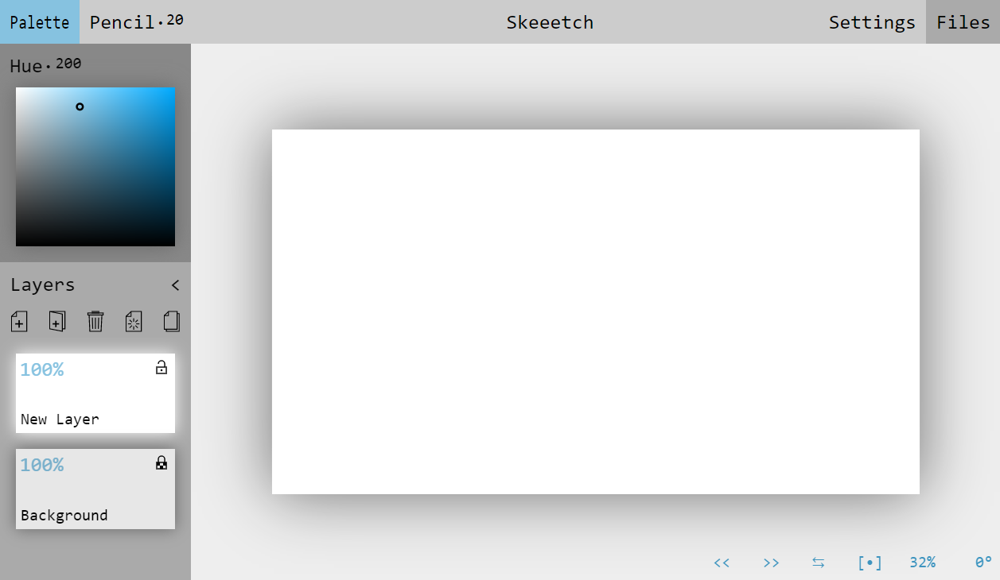
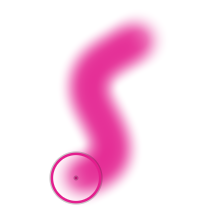

# Skeeetch Introduction

Skeeetch is a web-based sketchpad. It is elegant and powerful, open-source and free to use.

Skeeetch is available on the website without download:

### [**> Open Skeeetch <**](https://iraka-c.github.io/Skeeetch/index.html?lang=en)

You can **save Skeeetch in Bookmark** to access it later.

Current version: `Ver. 20201223`

-----

Skeeetch supports：

* pressure-sensitive paint brushes, customized brushes
* layer and layer group management
* auto save
* image and `.psd` file import/export
* ... and even more! Check them out.

## Index

* [A First Glimpse](#afirstglimpse)
* [Basic Operations](#basicoperations)
* [FAQs (WIP)](#faqs)
* [**User Manual**](./manual/index.md)
* [Developer Manual (WIP)](./dev/index.md)
* [TODOs](#todos)
* [License](#license)

## A First Glimpse

There are three major areas: title bar, layer panel, and canvas window。

**The title bar** contains palette button, brush button, sketch title, setting button, and file button. Click on the sketch title to change the file name. Click other buttons to expand menus.

On the upper side of the **layer panel** is the palette, and the rest of the part the layers. Click on the palette button to expand/collapse the palette. Drag on the palette to choose a color.

The five buttons on the top of layers are new layer, new layer group, delete, clear/merge group, and copy. The rest of the layer panel contains icons of the layers.

In the center of the **canvas window** is the paper area where you can sketch. There will also be some information shown on the bottom-left. On the bottom-right, there are also some buttons, including undo `(Ctrl+Z)`, redo `(Ctrl+Shift+Z/Ctrl+Y)`, flip, reset position, zoom, and rotate. Some buttons are only visible when the mouse cursor approaches them.

## Basic Operations

### Draw a line

> Sketch an S curve with Pencil.

Select a color on the palette, and use mouse/touchpad/pen to draw the curve you like on the paper. By default, a round cursor shows the brush tip over the paper. If for any reason sketching is disabled (e.g. layer locked, invisible, or brush not supported), the cursor turns into a 🛇.

If you use force/pressure device, the size or opacity will follow the pressure you apply. Please refer to chapter [Brush Settings](./manual/brush.md)。

Place the cursor over the brush button to list all brushes, and click on one brush to use it. **Drag** or **scroll** on the button to change the brush tip size. Most numeric values in Skeeetch support dragging and scrolling actions.

Now that you have something on the canvas. Try to close this page and reopen it. Your contents are all here, automatically saved **in browser**. In this way, you can continue you drawing the next time you start Skeeetch. For more details, refer to chapter [Auto Save](./manual/pc-files.md#savefileinbrowser).

> Hint: Skeeetch by default saved contents in local drive, which means your contents are not uploaded to the Internet or shared with other software. This means you CANNOT access the contents if you change a browser or computer!

### Paper position

Change the value of **zoom** (in percentage) and **rotate** (in degrees clockwise) to change the position of the paper. You can drag the value, scroll on the value, or input the value by keyboard to change it. You may also scroll on the canvas area (or drag up & down with two fingers on a touchpad) to zoom in/out.

Press `Shift` while scrolling on the canvas area to rotate the paper.

Press `Shift` while dragging the paper will **move** the paper horizontally/vertically. You can see a "moving" cross shaped mouse cursor. It is also possible to move the paper by dragging on the touchpad around with two fingers while pressing `Ctrl` key.

Click the `⇆` button on the bottom-right corner will **flip** the paper horizontally. This is only a flip of the view, NOT the actual contents in the paper.

**Reset paper position** by clicking on the `[•]` button.

### Layers

On your first visit to Skeeetch, you can see a white background layer and a new layer.

Click  button to create a **new layer**. You can click on the "New Layer" text to rename it.

Click on one layer to activate it (light it up). It will be the target of all your actions in the canvas window.

Click  button to delete a layer.

### Color picker

Use the right click or `Alt`+Left click to pick a color from the paper and load it to the palette. The color picked is what you see on the paper.

### Undo and redo

Skeeetch supports undo and redo actions to surf through the drawing history. You can click the `<<` or `>>` button to undo/redo one step, or to use the hotkey `Ctrl+z` for undo, and `Ctrl+Shift+z` or `Ctrl+y` to redo.

For more keyboard shortcuts, see [**Keyboard Shortcut** (Hotkey)](./manual/hotkey.md).

### I need more details

Please refer to the [User Manual Index](./manual/index.md)

## FAQs
Please refer to the [FAQs](./manual/QA.md) (WIP)

## TODOs

* fill out the manuals and devs
* multilingual support
* <del>multitouch, touch screen support</del> <ins>(It's OK to support single touch for drawing at present)</ins>
* core brushes (blur, color filling, stamp, customized, etc.)
* layer transform, <del>crop</del>
* effect layer (exposure, contrast, saturation, ...), histogram
* guidelines and perspectives

Development route: <del>color to transparency</del> => hot key system => path speed for smudge tool => blur/filling => <del>crop</del> => transform => customized brush tip => effect layers => histogram => guidelines => texts?

## License

Please read and accept the agreements below before using Skeeetch.

Skeeetch is distributed based on *Apache License 2.0*. *Apache License 2.0* applies to all codes and resources in this repository, but not to the contents created and actions performed by the user.

Skeeetch only provides a web-based UI and associated resources, and will not be responsible for any loss when using this service, including property loss and data loss.

