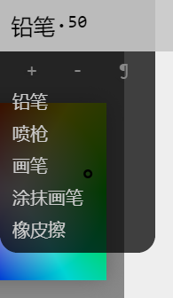
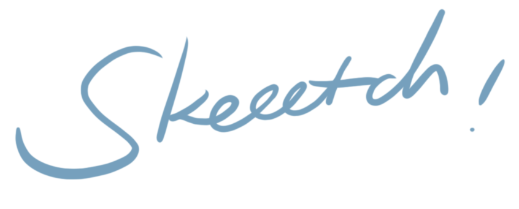
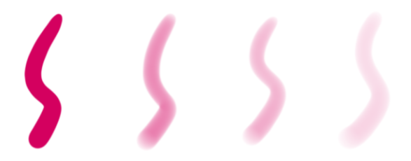
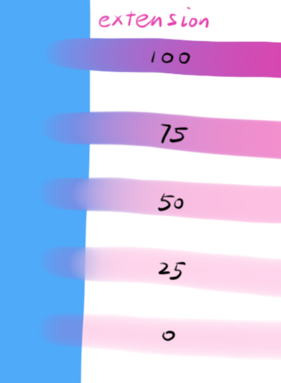
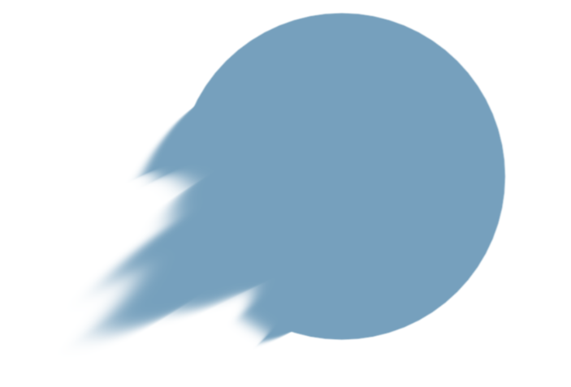

# 笔刷

Skeeetch中有几种默认笔刷。你也可以以这些笔刷为模板自定义笔刷来营造丰富的效果。这些笔刷都使用[调色盘]()的颜色进行绘制。

点击位于顶栏的**笔刷按钮**可以展开/折叠笔刷详细设置菜单。

## 默认笔刷

### 铅笔

铅笔是最简单的画笔，其作用就是跟随笔尖画出一条线。

铅笔有几个基本参数。最显眼的就是它的**尺寸**，即直径/像素。这个值显示在笔刷按钮上，同时也是笔刷菜单笔刷尺寸控制的第一项。可以通过该项目/笔刷按钮来调节尺寸。

如果希望使用压感设备控制笔刷尺寸，需要开启**压感尺寸**选项。此时，笔刷的尺寸将随压感在**最小尺寸**和**尺寸**之间变化。请注意，如果关闭了压感尺寸，或者将最小尺寸设置为和尺寸相同，则笔刷尺寸不会随着压力而变化。

铅笔的另外一个属性是它的**颜色不透明度**。它表示在绘制的时候将多少比例的笔刷颜色叠加到画纸上。不透明度100%表示用笔刷颜色完全替换纸上的颜色，0%则表示完全没有颜色。不透明度也可以使用压感控制，需要打开**压感不透明度**开关并设置**最小不透明度**。

> 不透明度 100%，75%，50%，25% 的笔刷效果
>
> 注意：笔刷透明度是笔刷颜色的堆积，在同一位置反复绘制会持续增加此处的不透明度，和设置图层不透明度效果不同。

**硬边缘**选项控制笔刷的柔边。其值为0～1，分别对应完全模糊的边缘和完全分明的边缘。

在数位笔控制选项中，**笔压灵敏度**控制画笔笔压的敏感程度。数值为0～2，值越小则笔压越容易变大。1为默认笔压（线性）。使用低灵敏度可以绘制柔软的粗线条，而高灵敏度可以绘制尖锐的笔触。

**抖动修正**选项用于修正因手部抖动或光标飘移造成的线条抖动。数值越大则线条方向对光标的抖动越不敏感，画出的线条越圆滑，同时绘制的延迟也会增加，最大级别为10。0代表无修正。这个值也可以为负数-1～-5，这些级别反而会放大光标的抖动，使线条更扭曲。

### 喷枪

(TODO 目前就是个软边画笔)

### 画笔

画笔模拟的是油画笔/水彩画笔在添加笔刷颜色时也会将画布上已有颜色涂抹开的行为，可以视为一支有**颜色惯性**的铅笔。这和PS中的画笔&涂抹或SAI中的画笔工具很类似。

> 同样的颜色下，几个配置不同的画笔

画笔除了拥有铅笔的属性以外，会多出一个延伸属性。这个属性控制了画笔沿途涂抹颜色的强度——不完全是。对于**颜色不透明度**和**延伸**所控制的功能说明如下：

* 颜色不透明度：从**调色盘**添加的颜色的比例
* 延伸：调色盘颜色**之外**，从画笔经过的位置**吸取**颜色的比例

因此，如果颜色不透明度为100%，则意思是**所有颜色**都从调色盘取得，此时延伸选项是不起作用的。画笔的表现应该和铅笔完全一致。如果颜色不透明度为80%，则剩下的20%中，画笔吸取的颜色占比为延伸量。如果颜色不透明度为0%，则延伸量完全控制了画笔涂抹颜色的强度。一般的画笔工具可能会有干湿（水分），混合（混色）等多个参数来调节颜色的变化量，但实际上通过**颜色不透明度**和**延伸**两个选项已经基本概括画笔颜色的变化情况。

 

> 笔刷效果随颜色不透明度（左）和延伸（右）变化的效果。注意延伸不同时看上去笔刷颜色量也在变化，这是因为延伸选项同时也在涂抹之前已经画在画纸上的笔刷颜色，叠加起来比不延伸的颜色总量要多一些。实际使用时可以根据画面效果来调整。延伸为0时画笔变为铅笔效果。

注意：在透明的区域使用画笔或使用软边画笔时，同样数值的效果会和在不透明颜色上使用硬边画笔的延伸效果有差异。

### 涂抹画笔

涂抹画笔用于在画纸上沿画过的地方涂抹颜色。

涂抹画笔的**延伸**选项控制了涂抹的强度：0%意味着完全没有涂抹，100%会将笔刷经过地方的颜色一直涂抹下去。选取中间的值可以沿着绘制的线条涂抹一定的距离。涂抹强度也受压感和**压感不透明度**选项控制。

> 延伸 100，80，50 的笔刷效果

涂抹画笔也可以带有一定颜色。将**颜色不透明度**设置为大于0%的值可以在涂抹时混入一定的颜色。

### 橡皮擦

橡皮擦和画笔的基本设置相同，而不同之处主要在功能方面：橡皮擦会清除画纸上已有的颜色。

对一个透明度未锁定的图层，橡皮擦会让划过的区域变得透明。对透明度锁定的图层，橡皮擦相当于纯白色画笔。

## 笔刷抗锯齿

在*设置* > *纸张* > *抗锯齿* 项目中可用开启/关闭抗锯齿。详见[系统设置](./system.md)章节。

## 自定义笔刷

（TODO）