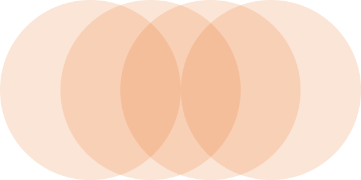
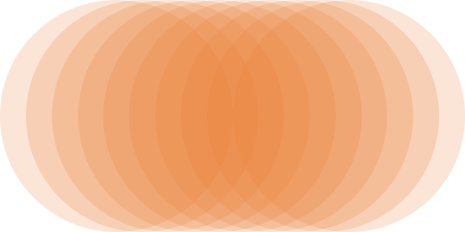
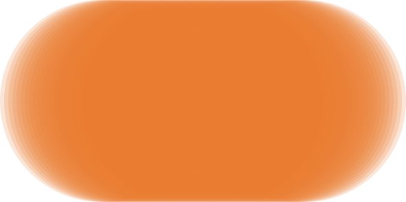
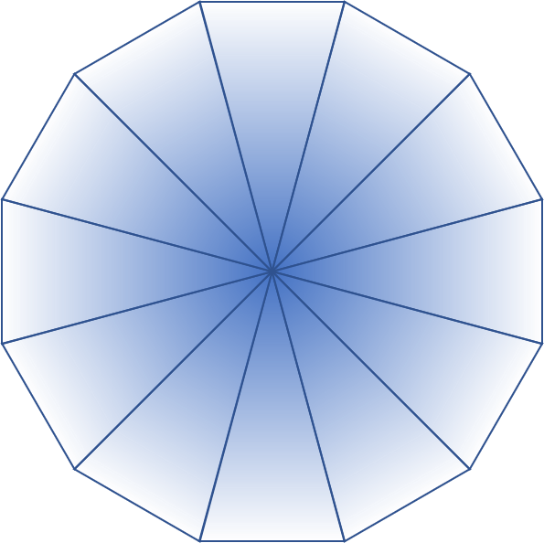
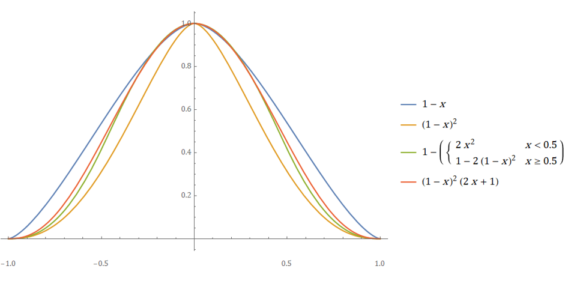
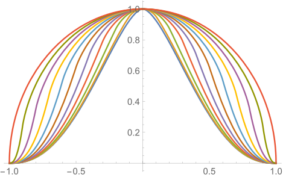

# 笔刷

本章Skeeetch的渲染算法。关于笔刷管理器，详见[笔刷管理]。

## 笔刷渲染

笔刷渲染由两部分组成：**轨迹生成**和**纹理渲染**。一个笔刷可以看作将一个贴图纹理沿一定的轨迹不断叠加的过程，而轨迹生成负责计算纹理叠加的位置和方向，纹理渲染负责将纹理按生成的轨迹放到画布上。

### 简单轨迹生成

一个最基本的轨迹是一条二阶贝塞尔曲线（抛物线）。在`CANVAS.stroke`中将贝塞尔曲线的三个控制点传给`CANVAS.renderer.strokeBezier`函数来得到轨迹。这三个控制点分别是：上上次光标位置和上次光标位置的中点、上次光标位置、与上次光标位置和此次光标位置的中点。

> 深蓝色的点为CANVAS接收到的光标轨迹，橙色的点为深蓝色点的中点，表示贝塞尔曲线的开始和结束控制点。橙色曲线为生成的轨迹。

`CANVAS.renderer.strokeBezier`为renderer基类`BasicRenderer`的方法，其中用到了`q-bezier.js`中的`QBezier`类。这个类的对象描述了一条二阶（含一阶、零阶）贝塞尔曲线，有很多关于求值和长度计算的方法。关于贝塞尔曲线的基础参见[这里（英）](https://pomax.github.io/bezierinfo/)。

从光标位置得到`QBezier`轨迹之后，由于笔触的各个位置颜色应当是均匀的，而实际接收到光标位置的间距不均匀，同时贝塞尔曲线的弧长与参数变化量之比也是（极其）不均匀的，我们需要沿轨迹**等距**地布置纹理位置。这使用到了通过曲线长求参数的`QBezier.getTWithLength`方法。这个方法通过二分法（精度$10^{-4}$）求使得曲线长为目标长度的参数$t$的方程来得到新的纹理位置。方程求解的函数为`QBezier.getArcLength`函数，使用具有显式表达式的曲线长定积分来计算弧长（拥有弧长的显式表达式也是二阶贝塞尔曲线的优点）。定积分的求解位于`QBezier._getQuadraticIntegrateVal`函数中。实际应用中计算定积分和方程求解的时间相比渲染时间可以忽略不计。

> 均匀参数（左）和均匀弧长（右）的分布效果

得到纹理中心的位置后，就可以根据位置对应的参数对压感、笔刷半径、透明度等参数进行插值，并最终输出一个`[wL,wH,hL,hH,kPoints]`型的轨迹。其中`wL,wH,hL,hH`描述了轨迹渲染的最大/最小像素范围，`kPoints=[[x,y,r,d,Sa,Pa], ...]`描述了一系列贴图位置的参数。

### 铅笔

#### 笔尖纹理

铅笔是最简单的笔刷，通过向画布上叠加一系列的圆就可以绘制。关于铅笔的基础可以看[这篇文章（英）](http://perfectionkills.com/exploring-canvas-drawing-techniques/)，其中描述了一些基本的笔刷渲染模式和特效（基于`CanvasRenderingContext2D`）。

我们希望绘制一个带透明度的笔刷，即新的圆形不会完全遮蔽下面的内容，而是增加一个半透明的颜色。根据[不透明度混合的原理（英）](https://www.w3.org/TR/compositing/#whatiscompositing)，在笔刷的圆的颜色为**Cc**（RGB分量）不透明度为**αc**，底色为**Cb**不透明度为**αb**时，混合后的颜色**Cr**和不透明度**αr**可以用下式表示：
$$
\begin{aligned}
\alpha_r&=\alpha_c+\alpha_b(1-\alpha_c) \\
C_r&=\frac{\alpha_c C_c+\alpha_b C_b(1-\alpha_c)}{\alpha_r}
\end{aligned}
$$
如果我们用**c**表示**α·C**即经过不透明度预处理（Pre-Multiply Alpha）的结果，那么上面两个式子可以合为一个：
$$
c_r=c_c+c_b(1-\alpha_c)
$$
好的，那么就直接按这个式子将一个圆内的像素和底色混合吧。这里存在一个问题：圆的透明度**αc**应该选择多少。如果我们希望最终结果有80%的透明度，那么选择αc=0.8肯定不行，因为沿途有好多个圆重叠在一起，最终的结果肯定会比0.8大得多。

我们考虑一条笔触正中间的某个像素，假设有**q**个圆重叠在一个像素上。这里的q也叫笔刷的**质量**，因为q越大那么圆之间的排列越紧密，最终笔触的绘制效果也会越流畅（看不到单个圆的边缘）。

| q = 4                              | q = 10                              | q = 50                              |
| ---------------------------------- | ----------------------------------- | ----------------------------------- |
|  |  |  |

> 不透明度0.2的4, 10, 50个圆沿直线重叠在一个点上的效果

那么根据上面的混合公式，我们可以得到最终这个像素的**不透明度**是：
$$
\alpha_r=1-(1-\alpha_c)^q
$$
因此，如果给定最终笔刷的不透明度αr和笔刷质量q，就可以确定单个笔刷纹理的不透明度是
$$
\alpha_c=1-(1-\alpha_r)^{1/q}
$$
这里涉及一个问题：q应该如何选取。

理论上，q越高就可以得到越细腻的笔刷，但过高的q存在两个问题：

1. GPU的渲染中圆是用三角形近似的。绘制过多的圆会导致三角形数量增加，加大CPU负担。
2. 在不透明度较低时，q越高αc越低。过低的αc将在执行不透明度混合的乘法时产生较大的误差，形成颜色噪声（伪色）。

因此，我们希望q是有一个上界的。在32位渲染下乘法精度较高，可以容纳更低的αc。我们选取q最大为100。在16位和8位模式下q的上界分别是20和10。超过这个上界容易产生严重的杂色。在笔刷半径较小时，不需要这么高的q也可以实现平滑的笔触，因此当假设两个笔刷纹理最小相距一像素时，q的上界可以是笔刷直径的像素数。另外，使用软边笔刷时可以用更小的q值来保证看不出明显的笔刷纹理边缘，详见软边笔刷的渲染。

#### 软边笔刷

上述的笔刷渲染过程产生的笔刷边缘是硬的，意思是笔刷纹理每一个像素的不透明度要不然是αc，要不然是0（超出笔刷范围）。这在使用像素效果的画笔时是有用的，但一般来说，我们希望笔刷的边缘可以是一个平滑的过渡来创造渐变效果。这就要求渲染时产生不透明度的渐变。

我们利用GLSL着色器中的`varying`变量来产生过渡。`varying`变量自身就可以实现在片元着色器中的插值，因此在顶点着色器用三角形渲染圆的形状时，我们赋予一个变量r：圆心处的顶点r=1，圆周上的顶点为r=0。这样，片元着色器中接收到的变量r就是这个像素到圆周的距离（半径为1）。

> 到圆周距离变量值，颜色深浅表示变量大小。这里用12片三角形近似一个圆。

如果对每个像素的不透明度αc乘以r，就可以得到一个模糊的圆了，看上去似乎过渡很平滑。但这里有一个问题：当若干个这样的圆重叠在一起的时候，过渡还会这么平滑吗？

让我们考虑这样的情况：若干个相同颜色的圆依次以不透明度f1, f2, ..., fN覆盖在某个像素上。预设笔触不透明度是α（充分接近0以便利用级数近似）。那么最终这个像素中笔刷颜色的不透明度是：
$$
\begin{aligned}
	\alpha_r &= 1-\prod_{i=1}^N (1-f_i\alpha_c) \\
	&= 1-\exp\left[\sum_{i=1}^N \ln\left[1-f_i\left(1-(1-\alpha)^{1/N}\right)\right]\right] \\
	&\approx 1-\exp\left[\sum_{i=1}^N \ln(1-f_i\alpha/N)\right] \\
	&\approx 1-\exp(-\frac{\alpha}{N}\sum_{i=1}^N f_i) \\
	&\approx \frac{\alpha}{N}\sum_{i=1}^N f_i
\end{aligned}
$$
为便于计算，考虑当N趋近于无穷大。用f(r)表示距圆周为r时的不透明度，我们有：
$$
\begin{aligned}
	\lim_{N \to \infin} \frac{\alpha}{N}\sum_{i=1}^N f_i
	&= \alpha \int_0^1 f(r)\mathrm{d}r
\end{aligned}
$$
注意笔尖是从圆周扫过像素到圆心，又继续从圆心扫到圆周的过程。由于在求和时采用平均值，只考虑其中的一半（r从0到1）结果不变。

对于并非位于笔触中心的像素，假设其距离笔触中心为t（倍半径），则可以计算相对不透明度变化率αr(t)/α：
$$
\begin{aligned}
	\frac{\alpha_r(t)}{\alpha} &\approx \int_0^{\sqrt{1-t^2}} f(\sqrt{r^2+t^2}) \mathrm{d}r \\
	t &\in [-1,1]
\end{aligned}
$$
好了，现在我们可以代入不同的f来看看经过一阵涂抹，笔触的不透明度分布究竟长什么样。通过绘制αr(t)/αr(0)即相对中心的不透明度变化率可以得到如下曲线：

从上图可以看出，直接选取f(x)=1-x（即r，蓝色线）会在边缘处形成非零的梯度（生硬的渐变）。我们选择最尖锐的f(x)=(1-x)^2函数，因为它有能力变得更平滑。通过引入硬边缘参数**b**（0~1）使得不透明度函数变为：
$$
f_1(r)=\begin{cases}
	f(r/b) & r<b \\
	f(1) & r\ge b
\end{cases}
$$
我们就可以控制硬边缘占整个半径的比值。可以画出不同硬边缘b下笔触总体不透明度的分布曲线为：

> 总体笔触不透明度足够小时，笔刷不透明度分布和硬度的关系图，从0~1每隔0.1。当然总体不透明度和硬度都接近1时，上述近似式失效，笔刷不透明度分布就接近均匀分布了。

这里的硬边缘参数就是笔刷的`brush.hardness`变量。它在之后的自定义笔刷中也会出现。

### 画笔

画笔可以看作一个带有颜色“惯性”的铅笔。

画笔相比普通笔刷多出了额外参数`brush.extension`，即延伸量。画笔的渲染逻辑依然是先渲染到临时纹理`brushtipImageData`再复制回原`imageData`，只不过多出了颜色采样的部分，而延伸量控制的即为颜色采样的比例。绘制的流程如下：

1. 从源图像的笔刷中心位置选取颜色`samp_color`**Cs**，并乘以采样比例**α**。
2. 将笔刷颜色**Cc**乘以采样比例**1-α**，并和源图像颜色采样相加。
3. 将相加后的颜色乘以笔刷纹理透明度**β**，绘制到临时纹理。
4. 将临时纹理以普通混合模式绘制到源图像相应位置。

---

我们考察这样的情况：从原色**Cs**向背景颜色**Cb**上延伸笔刷颜色**Cc**。

如果假设绘制第n个纹理时，绘制前笔刷中心位置的颜色为**a(n-1)**，绘制后颜色为**a(n)**，如果源图像不透明度为1（完全不透明），则从上述步骤可以得出如下关系（利用笔刷不透明度混合公式）：

要计算经过n步混合后的颜色，设，于是有：

我们希望笔尖在运动在给定的相对笔刷直径的距离d之后新颜色Cc能增加至一定的比例。假设画过d=1倍直径的距离后笔刷颜色含量增加为**δ**（即笔刷颜色不透明度），由于1倍直径中包含**q=**`renderer.quality`次绘制，此时的Cc含量为：

另外，希望原色Cc含量在剩余的1-δ部分颜色中减至**0<ε<1**，于是有：

综合上述方程，可以得到：

解得：

可以发现$k$就是之前在铅笔算法处推算出的**笔刷纹理透明度**。另外，ε控制了颜色延伸量，但这并不是一个随`brush.extension`均匀变化的参数。用：

得到视觉上和`brush.extension`符合较好的延伸量，由于可能出现ε>1，需要做截断。注意由于软边笔刷沿笔触不透明度相比硬边画笔都是降低的，降低Hard Edge会使得延伸量也同时略微减小。

此外，如果背景颜色Cb带有透明度，画笔混色算法会将Cs的透明度一并叠加到Cb上，使得延伸量的模型发生变化。无所谓啦……

