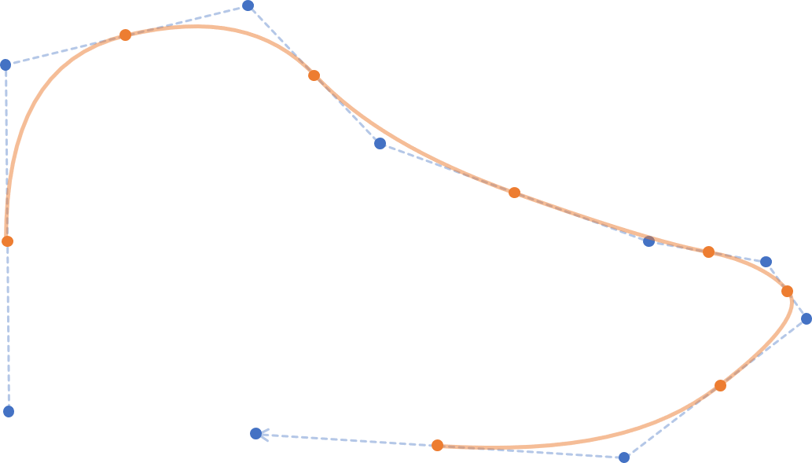
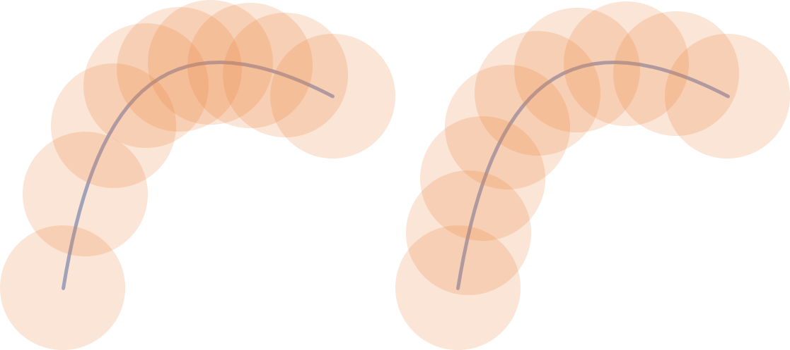
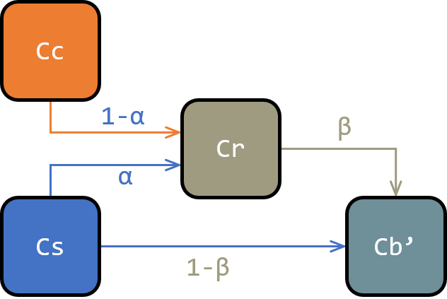

# 笔刷

本章Skeeetch的笔刷管理和渲染算法

## 笔刷管理

## 笔刷渲染

笔刷渲染由两部分组成：**轨迹生成**和**纹理渲染**。一个笔刷可以看作将一个贴图纹理沿一定的轨迹不断叠加的过程，而轨迹生成负责计算纹理叠加的位置和方向，纹理渲染负责将纹理按生成的轨迹放到画布上。

### 简单轨迹生成

一个最基本的轨迹是一条二阶贝塞尔曲线（抛物线）。在`CANVAS.stroke`中将贝塞尔曲线的三个控制点传给`CANVAS.renderer.strokeBezier`函数来得到轨迹。这三个控制点分别是：上上次光标位置和上次光标位置的中点、上次光标位置、与上次光标位置和此次光标位置的中点。

> 深蓝色的点为CANVAS接收到的光标轨迹，橙色的点为深蓝色点的中点，表示贝塞尔曲线的开始和结束控制点。橙色曲线为生成的轨迹。

`CANVAS.renderer.strokeBezier`为renderer基类`BasicRenderer`的方法，其中用到了`q-bezier.js`中的`QBezier`类。这个类的对象描述了一条二阶（含一阶、零阶）贝塞尔曲线，有很多关于求值和长度计算的方法。

从光标位置得到`QBezier`轨迹之后，由于笔触的各个位置颜色应当是均匀的，而实际接收到光标位置的间距不均匀，同时贝塞尔曲线的弧长与参数变化量之比也是（极其）不均匀的，我们需要沿轨迹**等距**地布置纹理位置。这使用到了通过曲线长求参数的`QBezier.getTWithLength`方法。这个方法通过二分法（精度$10^{-4}$）求使得曲线长为目标长度的参数$t$的方程来得到新的纹理位置。方程求解的函数为`QBezier.getArcLength`函数，使用具有显式表达式的曲线长定积分来计算弧长。（拥有弧长的显式表达式也是二阶贝塞尔曲线的优点）定积分的求解位于`QBezier._getQuadraticIntegrateVal`函数中。实际应用中计算定积分和方程求解的时间相比渲染时间可以忽略不计。

> 均匀参数（左）和均匀弧长（右）的分布效果

得到纹理中心的位置后，就可以根据位置对应的参数对压感、笔刷半径、透明度等参数进行插值，并最终输出一个`[wL,wH,hL,hH,kPoints]`型的轨迹。其中`wL,wH,hL,hH`描述了轨迹渲染的最大/最小像素范围，`kPoints=[[x,y,r,d,Sa,Pa], ...]`描述了一系列贴图位置的参数。

### 铅笔

铅笔是最简单的通过

### 画笔

画笔可以看作一个带有颜色“惯性”的铅笔。

画笔相比普通笔刷多出了额外参数`brush.extension`，即延伸量。画笔的渲染逻辑依然是先渲染到临时纹理`brushtipImageData`再复制回原`imageData`，只不过多出了颜色采样的部分，而延伸量控制的即为颜色采样的比例。绘制的流程如下：

1. 从源图像的笔刷中心位置选取颜色`samp_color`**Cs**，并乘以采样比例**α**。
2. 将笔刷颜色**Cc**乘以采样比例**1-α**，并和源图像颜色采样相加。
3. 将相加后的颜色乘以笔刷纹理透明度**β**，绘制到临时纹理。
4. 将临时纹理以普通混合模式绘制到源图像相应位置。

---

我们考察这样的情况：从原色**Cs**向背景颜色**Cb**上延伸笔刷颜色**Cc**。

如果假设绘制第n个纹理时，绘制前笔刷中心位置的颜色为**a(n-1)**，绘制后颜色为**a(n)**，如果源图像透明度为1（完全不透明），则从上述步骤可以得出如下关系：

要计算经过n步混合后的颜色，设，于是有：

我们希望笔尖在运动在给定的相对笔刷直径的距离d之后新颜色Cc能增加至一定的比例。假设画过d=1倍直径的距离后笔刷颜色含量增加为**δ**（即笔刷颜色不透明度），由于1倍直径中包含**q=**`renderer.quality`次绘制，此时的Cc含量为：

另外，希望原色Cc含量在剩余的1-δ部分颜色中减至**0<ε<1**，于是有：

综合上述方程，可以得到：

解得：

可以发现$k$就是之前在铅笔算法处推算出的**笔刷纹理透明度**。另外，ε控制了颜色延伸量，但这并不是一个随`brush.extension`均匀变化的参数。用：

得到视觉上和`brush.extension`符合较好的延伸量，由于可能出现ε>1，需要做截断。注意由于软边笔刷沿笔触透明度相比硬边画笔都是降低的，降低Hard Edge会使得延伸量也同时略微减小。

此外，如果背景颜色Cb带有透明度，画笔混色算法会将Cs的透明度一并叠加到Cb上，使得延伸量的模型发生变化。无所谓啦……

