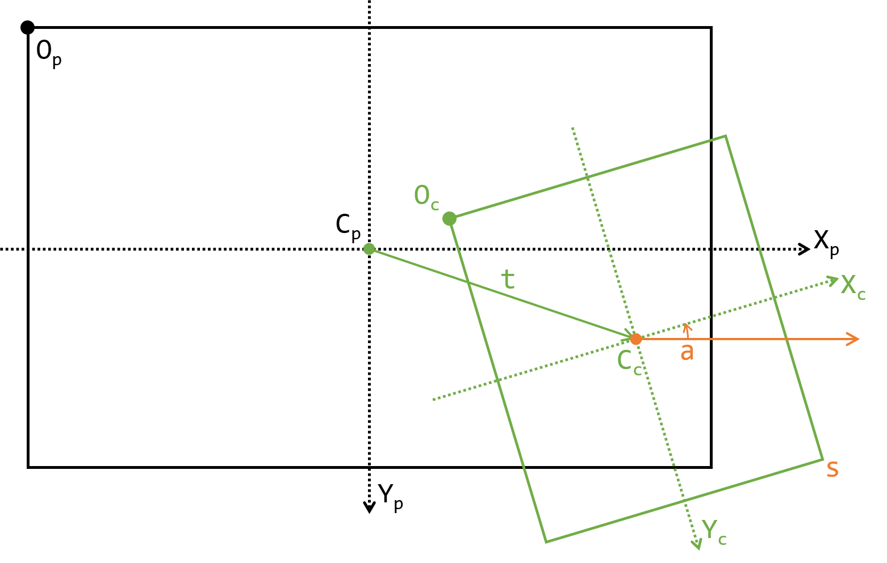

# 画布

Skeeetch的画布主要由两个程序管理：

* `environment.js`和`environment-effects.js`管理画布的位置和启动，负责全局变量`ENV`
* `canvas.js`将用户的输入转换为画布的绘制逻辑，负责全局变量`CANVAS`

关于画布内容的渲染与合成，参见[画布渲染（笔刷）](./render.md)和[画布渲染（图层合成）](./composition.md)章节。


## 画布位置控制

### 画布位置简介

Skeeetch中有一个画布区窗口和画布的实际区域。

画布区窗口`#canvas-area-panel`相对主界面保持不变。

画布实际显示区域`#canvas-container`会随用户的平移/旋转/缩放/翻转操作而改变。它们的关系如下图所示：



其中

* Op, Oc 为窗口和画布的原点
* (Xp, Yp), (Xc, Yc) 分别为窗口和画布的X轴方向和Y轴方向
* Cp, Cc 为窗口和画布的中心点
* t为Cc相对Cp的平移量，以Op为参考坐标
* a为Xc相对Xp的逆时针旋转角度
* s为OcXcYc相对OpXpYp单位长度的缩放量，OpXpYp中的1单位长度为OcXcYc中的s单位长度
* 此外，还有一个f参数（布尔变量），指示Xc是否沿Yc翻转

在Skeeetch中用如下结构体表示这些变量：

```javascript
ENV.paperSize={ // 纸张的尺寸
	width: 0, // 横向尺寸（纸张像素）
	height: 0 // 纵向尺寸（纸张像素）
};
ENV.window={
	SIZE: { // 画布区的显示尺寸
		width: 0, // 画布区宽度（屏幕像素）
		height: 0 // 画布区高度（屏幕像素）
	},
	trans: { // 纸张中心相对画布区中心的平移（屏幕像素）（变量t={x,y}）
		x: 0,
		y: 0
	},
	rot: 0.0, // 纸张相对画布区逆时针旋转角度（变量a）
	flip: false, // 纸张是否相对自身的Y轴翻转（变量f）
	scale: 1.0 // 纸张相对画布区的缩放（变量s）
};
```

Skeeetch提供几个函数来方便地操作这些变量：

```javascript
ENV.setFlip(isFlip); // 将画布翻转设置为isFlip
ENV.scaleTo(ratio); // 以画布区中心为原点将s设置为ratio
ENV.rotateTo(angle); // 以画布区中心为原点将a设置为angle角度（逆时针）
ENV.translateTo(x,y); // 将画布平移设置为(x,y)屏幕像素
ENV.transformTo(x,y,r,s); // 同时设置t,a,s三个变量

// 注意：s的范围限制为0.1~8.0，t的范围限制为画布对角线长范围以内。超过范围会被截断。
```

如果要设置画布尺寸，可以使用`ENV.setPaperSize(w,h)`函数将纸张尺寸设置为w*h纸张像素。这个函数的行为比较复杂，在[文件打开与保存]()中详细叙述。

### 画布变换矩阵

`ENV`内部将`t, a, s, f`变量转换为画布显示的位置是由CSS的`transform: matrix`实现的。这部分逻辑位于`environment-effects.js`。Skeeetch使用函数`ENV.getTransformMatrix([x,y,r,s])`来计算得到`#canvas-container`的变换矩阵`[a,b,c,d,e,f]`，即线性变换：

```
|a c e| |xc|   |xp|
|b d f|·|yc| = |yp|
|0 0 1| | 1|   | 1|
```

Skeeetch中有如下函数方便地进行坐标变换：

```javascript
ENV.toPaperXY(xp,yp)=>[xc,yc] // 从画布区坐标(xp,yp)变换为画纸坐标(xc,yc)
```

### 平滑滚动

Skeeetch使用变量`ENV.displaySettings.enableTransformAnimation`指示是否开启平滑滚动。可以使用`ENV.setTransformAnimation(isAnimate)`来设置此变量。

当使用[画布位置](#画布位置)中的任何一个函数设置`t, a, s`变量时，如果`enableTransformAnimation`为`true`，则ENV会使用函数`ENV.fireTransformAnimation([x,y,r,s])`启动一段动画，通过对画布变换矩阵进行线性插值来模拟平滑的变换。变换动画的速度会自动根据屏幕帧率进行调节，详见[性能管理](./performance.md)章节。

虽然CSS可以使用`transition: transform`来实现过渡动画，但这种实现有两个缺陷：

1. `transition: transform`通过对矩阵的每个元素进行线性插值来实现动画过渡，这在视觉上并不符合观感。
2. 角度在-180°和180°之间变化时，`transition: transform`的线性插值会产生经过0°的变换路径，导致突然的角度翻转。

因此，ENV中使用的动画直接对`t, a, s`进行线性插值，并处理了角度变换的特殊情况，产生平滑过渡的动画。每一帧动画由`ENV._transformAnimation()`触发，动画的中间状态用如下的结构管理：

```javascript
ENV.window._transAnimation={
	time: 1, // 动画持续时长/s
	target: [0,0,0,1], // 结束状态[x,y,r,s]
	start: [0,0,0,1], // 开始状态[x,y,r,s]
	now: [0,0,0,1], // 当前状态[x,y,r,s]
	process: 1, // 当前进度0~1（0为刚开始，1为结束）
	isAnimationFired: false, // 动画是否在进行中
	lastTime: 0 // 上一帧动画的触发时间
}
```

### 抗锯齿

ENV中用`ENV.displaySettings.antiAlias`布尔变量指示是否开启了全局抗锯齿。抗锯齿有两个作用：

1. 指示主画布`<canvas#main-canvas>`的CSS属性`.pixelated`，即是否以像素颗粒进行显示。
2. 指示渲染器在渲染像素时是否使用抗锯齿的算法

可以使用`ENV.setAntiAliasing(isAntiAlias)`函数来设置全局抗锯齿状态。


## 画布像素操作 - 笔触渲染流程

对画布的像素操作是由全局变量`CANVAS`完成的。CANVAS拥有以下成员变量：

```javascript
CANVAS={
	settings={ // 绘制相关的设置
		enabled: true, // 是否启用画布功能
		method: 1, // 渲染器类型：1为WebGL、2为CPU、3为Context2D。当前只支持WebGL
		smoothness: 3, // 光标抖动消除的等级
		_speed: 0 // 计算光标抖动消除的临时变量
	},
	rendererBitDepth: 32, // 渲染器位深度
	points: [[x,y,pressure]], // 已记录的光标[x,y,pressure]的列表
	targetCanvas: null, // 绘制的目标canvas， 目前固定为<canvas#main-canvas>
	nowLayer: null, // 绘制的目标图层对象，为一个CanvasNode对象
	changedArea: {width:0,height:0,left:0,top:0}, // 绘制中改变的区域（画纸坐标）
	drawSuccessful: false, // 上一次绘制是否成功
}
```

从落笔到在屏幕上显示出笔触的图像，CANVAS中经过了如下流程：

> CANVAS渲染环境初始化 - 更新光标位置 - 计算笔触曲线 - 渲染曲线至相应图层数据 - 图层合成 - 记录历史 - 自动保存

总的来说，`CANVAS`的初始化有三个阶段：

* 启动阶段：`CANVAS.init`设置画布的全局环境，载入用户设置
* 加载目标阶段：当指定一个新的[CanvasNode对象](./layers.md)作为绘制目标后，`CANVAS.setTargetLayer(canvasNode)`初始化图层的相关参数
* 绘制前阶段：当用户每次落笔后绘制第一个像素之前，`CANVAS.setCanvasEnvironment`初始化渲染环境的参数

### 启动阶段

`CANVAS.init`每次创建一个新的渲染器`CANVAS.renderer`，并丢弃旧的渲染器。关于渲染器详见[画布渲染（笔刷）](./render.md)。

### 加载目标阶段

`CANVAS.setTargetLayer(canvasNode)`将`canvasNode`设定为渲染的对象图层`CANVAS.nowLayer`，并用这个图层的信息更新渲染器的设置。关于图层的更多信息，详见[图层管理](./layers.md)。

`CANVAS.setTargetLayer`函数中，首先会丢弃旧的图层，并释放用于保存历史状态的`CANVAS.nowLayer.lastRawImageData`。`canvasNode.lastRawImageData`是一个特殊的[`imageData`](./layers.md)，它并不由`CanvasNode`自己管理，而由`CANVAS`负责分配和释放。

加载目标时`CANVAS`会给新的图层对象`CANVAS.nowLayer`赋予一个`lastRawImageData`，并将当前图层的内容`CANVAS.nowLayer.rawImageData`记入`CANVAS.nowLayer.lastRawImageData`。

此外，`CANVAS.setTargetLayer`会将`CANVAS.nowLayer.rawImageData`设置为渲染器`CANVAS.renderer`的渲染目标，以为后面的绘制笔触做准备。

### 渲染环境初始化

当用户落笔后，`CANVAS`从[`CURSOR`](./cursor.md)接到下笔的指令，便首先进行一次渲染环境的初始化。其内容包括：

* 考察`CANVAS.nowLayer`的图层属性（锁定、可见性等）决定绘制的方式
* 设置渲染器的笔刷、颜色、笔压灵敏度等属性

设置好这些内容后，每次光标在按下状态移动了一段距离，`CANVAS`便在`CANVAS.nowLayer.rawImageData`上相应地绘制出一段曲线、并显示到屏幕上。

### 更新光标位置

###计算笔触曲线

### 渲染曲线

### 图层合成

### 提笔之后

## 画布像素操作 - 其他操作

### 清空图层

### 取色

### 图层平移

