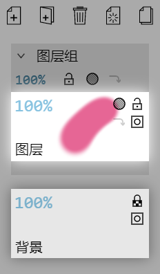
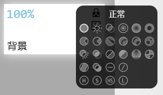

# 图层

Skeeetch支持图层和图层组的管理。图层的操作界面位于主界面左侧的**图层**选项卡，分为顶部的按钮和下方的图层列表两部分。

图层按面板顶部右侧有`<`按钮，可以用于切换图层栏的展开/收缩。收缩后的图层栏将只显示每个图层小的缩略图。

每个图层的背景是这个图层内容的**缩略图**。当缩略图尺寸大于图层图标时，在图层图标上移动光标可以浏览缩略图的不同部分。

> 图层面板按钮、两个图层、和一个图层组

## 增删图层

默认打开Skeeetch时的第一个图层是一个白色的背景图层。

点击图层面板按钮**新建**一个图层。你可以在图层名处输入来给新图层**重命名**。

点击某个图层的图标，图层图标会**点亮**指示当前绘制的对象是这个图层。

点击图层面板按钮将当前活动的图层**删除**。

在图层列表内图标过多时右侧会出现滚动条，可以拖动滚动条或在图层列表上滚动来上下浏览所有图层。

## 增删图层组

点击图层面板按钮**新建**一个图层组。图层组自身上不可绘制任何内容，但可以包含其他图层或图层组。你可以在图层组名处输入来给新图层组**重命名**。

点击某个图层组的图标，图层组的展开按钮`>`会**点亮**指示当前操作的对象是这个图层组。

点击图层组的展开按钮`>`可以在**展开/折叠**显示图层组内容之间切换。

点击图层面板按钮将当前活动的图层组**删除**。

## 改变图层顺序

按下一个图层/图层组的图标并在图层列表中**拖动**可以调整图层的顺序。你可以改变图层的前后顺序，将一个图层/图层组拖入或拖出某个图层组的列表。

## 图层属性

在图层标志左上角的不透明度百分比处输入数值/光标左右拖动/滚动可以调节图层的**不透明度**。从0%到100%的值对应完全透明到完全显示。在数值上右键单击或按住Shift键单击可以**隐藏/显示**图层。隐藏的图层不透明度将显示为`----`。隐藏的图层将无法绘制，也无法移动。

图层标志的右上角有几个按钮。最右上的是**锁定**按钮。点击它可以在解锁、锁定不透明度、锁定之间切换。锁定不透明度后图层像素的不透明度将不会改变，也无法移动。锁定后图层的任何像素将无法改变，只能改变隐藏/显示状态、剪贴蒙版、和编辑图层名。

图层按钮中靠左上的是**混合模式**按钮。点击以打开混合模式选择菜单。详见[混合模式](#混合模式)章节。

左下角的按钮是**剪贴蒙版**按钮，点击以切换剪贴蒙版状态。剪贴蒙板图层或图层组的右下角将显示一个灰色的三角标志。剪贴蒙版图层只显示其下方普通图层的不透明部分对应的内容。

（蒙版未完善）

图层组也有类似的属性，可以在图层组面板中点击对应的按钮来调整。注意：图层组的锁定按钮状态对其下属的所有图层/图层组均有效。

## 清空图层

当某个图层被选定时，图层面板中将出现按钮。点击此按钮将这个图层所有内容清空。注意已锁定（显示）的图层是无法清空的。对于透明度锁定（显示）的图层，清空操作将为所有像素填充白色而不改变其透明度。

## 合并图层组

当某个图层组被选定时，图层面板中将出现按钮。点击此按钮将这个图层组所有内容合并为一个图层，并取代原图层组的位置。

## 复制图层/图层组

（功能完善中）

## 混合模式

Skeeetch支持常见的26种混合模式（已实现22种）。默认情况下图层或图层组都是正常混合模式，并在图标上显示这个按钮。点击图层或图层组的混合模式按钮可以打开混合模式选择菜单：

菜单中每个图标对应一种混合模式，可以将光标移动到相应的图标上查看文字信息，点击以切换到该混合模式。

**透明度混合**

对于带有透明度的图层，一般有两种透明度混合模式：强度和填充。强度模式下像素透明度会影响混合的强弱，而填充模式下透明度只影响混合结果的透明度而不影响混合效果强度，因此对比一般会强烈一些。Photoshop默认使用强度模式，需要为图层取消“透明形状图层”来使用填充模式。SAI默认使用填充模式。

> 线性减淡模式的效果，使用强度混合（左）和填充混合（右）

在Skeeetch中可以设置全局的透明度混合模式：在 *设置* > *渲染器* > *透明度混合* 开关中可以选择**混合强度**（强度模式）或**中性色填充**（填充模式）。注意：对大文件，切换这个选项可能会比较耗时。

Skeeetch中支持填充模式的混合模式有线性减淡、线性加深、线性光、颜色减淡、颜色加深、亮光、差值共七种。

