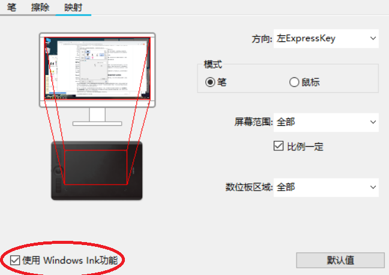

# 常见问题

## Skeeetch是个网页，意思是我画的东西都传到网上了？

**没有。**

虽然Skeeetch是基于网页的应用，但是Skeeetch的所有内容是安全地保存在本机硬盘里的，并没有上传到网上。

这意味着他人无法通过网络访问到你在Skeeetch中创作的内容——包括你自己。在一台电脑、一个浏览器中保存的内容无法通过其他电脑、浏览器获取到。

要上传内容到网络，可以使用Skeeetch内置的[云同步功能](./cloud.md)。

## 使用了数位板/压感屏幕，笔刷却对压力无反应

如果你使用了压感设备而笔刷对压感无反应，你可以检查：

* [笔刷设置菜单](./brush.md)中需启用压感并设置最小尺寸/透明度值
* Windows系统和数位板驱动中需启用**Windows Ink**功能
  
* 尝试重启浏览器或者重新连接压感设备

## Skeeetch在绘制时出现色差/杂色

> 使用低透明度的**纯蓝色**铅笔和涂抹笔刷在**8位位深度**下进行绘制时显现杂色

杂色一般是由于渲染精度不足造成的。较低的位深度在某些情况下会造成色彩信息丢失，将渲染器[**位深度**](./system.md#位深度)设置为**32位**可以解决这一问题。尽管如此，较高的位深度会增加储存的占用率，导致无法创建尺寸非常大的画纸或者打开大的文件。

## 我的Skeeetch在运行的时候很卡顿

卡顿可能是由多种原因造成的。首先我们需要保证一定的硬件配置。Skeeetch为了在网页上实现优质而快速的渲染对配置会有相对较高的要求。我们并未测定保障运行的最低硬件配置，但经过测试，Skeeetch也可以在小内存的破笔记本或手机上运行。当然实际的运行情况会随浏览器配置和工作负荷而变化。

尝试以下设置来解决卡顿：

| 设置内容                                                     | 可能造成的影响                                               |
| ------------------------------------------------------------ | ------------------------------------------------------------ |
| 降低[位深度](./system.md#位深度)                             | 颜色精度下降                                                 |
| 关掉一些浏览器页面或系统软件                                 |                                                              |
| 设置 > 显示 > 平滑滚动 > 关闭                                | 调整画纸位置时没有动画效果                                   |
| 设置 > 显示 > 抗锯齿 > 关闭                                  | 缩放画布时会有锯齿                                           |
| 设置 > 性能 > 刷新率限制 > 一个更低的fps                     | 在绘制时，过低的帧率看上去也会比较卡                         |
| 设置 > 性能 > 显存限制 > 一个更高的显存                      | 请根据自己电脑的实际配置和使用情况设置显存 否则可能出现**因爆显存而丢失内容**的情况 |
| 请使用Chrome/Firefox/Edge/Safari浏览器 更新浏览器至最新版，或换一个浏览器试试 |                                                              |
| 优化自己的绘画文件结构*                           |                                                              |
| 不要打开过大的文件                                           | 没能打开过大的文件                                           |
| 换一台好电脑                                                 | 没钱                                                         |

> \* 优化文件结构指的是通过合理创建图层组，将前后各种图层分组嵌套使得Skeeetch在渲染文件时能更好地优化渲染流程。一般而言，保证每个图层组（以及图层列表）中最多4~5个图层组可以有效加快渲染。最坏的情况是，所有图层全部一个个摊开在图层列表中，Skeeetch将无法通过图层间的关系优化渲染流程。

由于Skeeetch是基于网页的应用，其速度和系统资源占用不可能像系统上安装的软件一样理想。保证在更多平台上流畅运行是我们的一大目标。

## 为什么Skeeetch占用的内存和显存这么多

我们在制作Skeeetch时以运行速度和渲染效果为优先考虑，因此大量使用了内存或显存作为缓存，而且并未使用任何内存压缩技术。Skeeetch通过调用纯RAM渲染是**无法媲美桌面应用的速度和精度的**，因此使用了RAM/VRAM混合的渲染流程，但增加了储存空间的开销。在图层数量较多或画布尺寸较大时可能会出现大量占用系统内存或显存的情况。我们以后也会在保证速度和质量的条件下尽力优化Skeeetch的资源占用，以及测试不同平台上不同浏览器的渲染性能。

在一定需要打开大文件或操作大量图层的情况下，可以降低[渲染位深度](./system.md#位深度)通过牺牲一定的渲染质量来操作大文件或降低占用。这在某些特殊情况下可能导致杂色或画笔波纹，但你可以根据自己的内容需求来调节这一选项。试试看！

## Skeeetch相比Photoshop、CSP、SketchBook、SAI、Krita等绘画软件有什么优势吗

目前市面上有许多成熟的商业/开源绘画软件。它们提供丰富的功能、完备的界面和流畅的操作体验。Skeeetch并未计划取代这些软件。从理论上来说，要在Web界面获得系统级的应用体验也是极具挑战的。

我们认为Skeeetch的特性在于以下几点：

1. 面向Web环境的界面设计：Skeeetch尽量抛弃臃肿的窗口和庞杂的操作按钮，仅保留绘画所需要的最核心的功能，并利用Web界面用户友好的特性将它们直观地展示出来。**当然这并不意味着Skeeetch仅仅是一个“低配”版本的绘画软件代替品。**我们会在保持界面设计理念的基础上，努力使功能和可用性向其他成熟的绘画软件看齐。

2. 基于Web App的操作流程：将应用和网络的特性结合起来也是我们的一个目标。我们希望未来的绘画软件应该是基于云的：**在任何地方打开，在任何地方保存**。绘画的工作和文件的管理应当都可以在浏览器中进行而无需关心具体的操作系统或硬件设备。现在Skeeetch的[云储存与同步](./cloud.md)已经支持这一功能。

3. 精细的渲染模型：Skeeetch的内部工作逻辑设计一直是以优化速度体验和渲染精细度优先的，为此我们选择了WebGL技术，开发了一些新的算法来适配Web端存在的一些问题。Skeeetch支持每通道最大32位的渲染模式以保证颜色的精确还原，虽然这无疑会加重系统和硬件的负担，为了实现无伪影无色差的色彩还原，我们认为这是值得的。

4. 开发者友好：Skeeetch是一个**完全开源**的项目。代码逻辑完整，并且都配有良好的注释。这非常适合进行二次开发，如添加功能、增删组件、或者只是在你的网页中引用一下。我们会不断完善开发者文档以方便更多需要一个Web画板作为开发基础的人进行更多的尝试与探索。

   > 至少是这么想的。那什么时候补全开发者文档？Yay~

## 我可以多开Skeeetch标签页或者窗口吗

简单来说，**不行**。

如果你同时在多个标签页或窗口中打开，它们的设置和数据库会相互干扰，导致储存的内容出错或者过载。

如果试图多开Skeeetch页面，将会显示不可多开的提示。此时请关闭页面。切换画纸请使用文件-库。

>## 为什么Skeeetch设计为不支持多开？
>
>理论上一个简单的画板多开是可行的，但Skeeetch的一些特殊功能使得多开成为很棘手的事情：
>
>1. 所有Skeeetch标签页（同源标签页）共用一个数据库。不同页面对同一数据库的访问可能造成数据错误，或者工作不稳定。
>2. 即使通过一些同步措施使得多个页面可以顺利访问同一数据库，因为Skeeetch中的内容存在于一个WebGL上下文下，而不同页面的WebGL上下文是不同的，因此不可以共用资源（例如分配显存等）。而Skeeetch的显存管理器(VRAMManager)并不支持管理不同WebGL上下文的数据。这是WebGL技术天生决定的。
>3. 即使通过一些同步措施使得多个页面可以互斥地访问显存资源，这些措施带来的不稳定性远远超出了多开可能带来的收益。
>
>因此，Skeeetch在设计上即不支持多开页面。

## 我觉得这个破应用某个地方会出Bug，或者要是有某某功能就好了

Skeeetch开发者靠天吃饭，所以不一定能回应所有需求。但如果您发现了任何Bug或者有改进意见，欢迎在[GitHub Issues](https://github.com/Iraka-C/Skeeetch/issues)提出问题和建议。

## 我的Skeeetch没有反应了/无法完整启动

> 哦豁

参见[“系统重置”章节](./system.md#系统重置)。