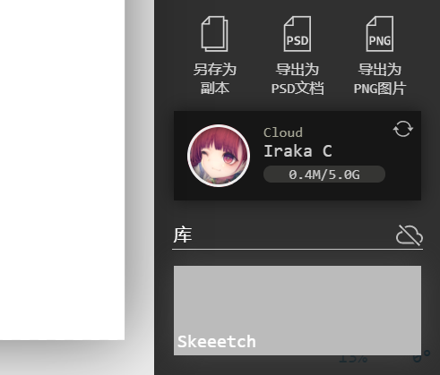
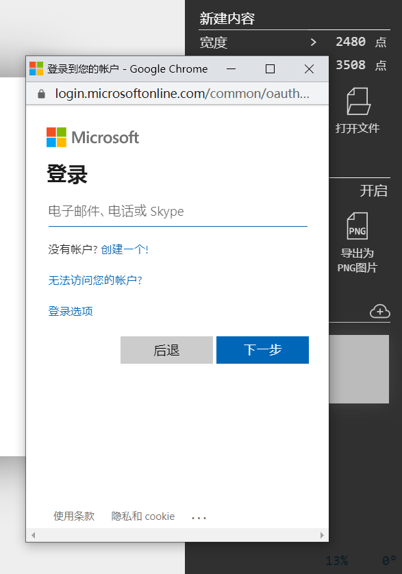
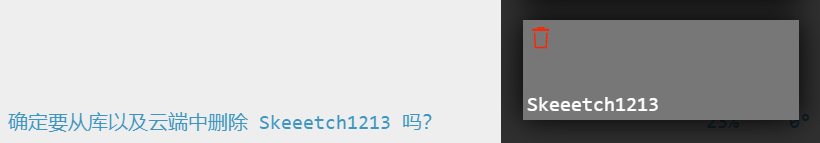

# 云储存

Skeeetch现在支持使用云储存服务对画纸进行同步。云储存使得你可以通过一个账户，在不同的机器或浏览器上继续你的创作。

> 2021.02.19：目前只支持微软OneDrive。今后可能会扩展至其他服务类型。
>
> 你可以使用微软（Microsoft）账户，或者个人的GitHub账户登录OneDrive。OneDrive默认提供5GB空间，大概可以储存100张画纸。

> 看到这个样子的界面，说明云储存已启用。界面左侧是头像，中间从上到下是云服务名，用户名，和储存用量。右侧是同步按钮。

云储存功能位于**文件菜单**中，库旁边的云形按钮。

## 启用云储存

云储存功能默认是关闭的。要启用云储存，点击文件菜单-库右侧的按钮。此时会弹出云服务选择界面。点击你想使用的服务以登录，或者取消。

点击服务后会进入登录流程。Skeeetch使用OAuth流程登录，因此<u>并不会储存或者泄露</u>您的用户名和密码。但是为了让Skeeetch的同步服务正常工作需要一些特别的权限，包括访问云储存空间以及获取用户信息。

> 如果浏览器提示有**弹出式窗口**被拦截，请允许其弹出：为保证安全性，OAuth登录仅可在弹出式窗口中完成！
>
> 第一次登录时会提示Skeeetch应用将访问储存和用户信息，请允许这些权限。

刷新网页或重新启动Skeeetch后，会自动重新登录这个云储存账户。如果太长时间没有登陆过，可能会需要重新登录。

## 登出云储存

登录成功后会自动加载您云储存账户的用户名，头像和储存空间。此时库右侧的云储存按钮会变成。点击按钮以**注销账户**，注销后再次访问云储存需要重新登录。

## 云同步

云同步的方式非常简单：只需点击云储存卡片右上角的同步按钮，即会自动将本地内容和云储存上的内容全部更新为最新。同步时按钮会旋转表示正在工作。与此同时库中被同步的文件上会显示圆形的同步进度条。

> **注意注意注意**：更新画纸为最新版本时会**覆盖**掉旧版本。如果有旧版本需要保留，请确认云同步之前已[导出画纸](./pc-files.md#导出和打开skeeetch画纸)或[创建副本](./pc-files.md#在浏览器中新建当前画纸的副本)！！！

云同步是**手动进行**的，意思是你对画纸进行任何改动后必须点击按钮，才能同步本地和云上的内容。这与库中画纸能自动保存每一次修改有所区别。

云同步示例：想将A电脑中Skeeetch的内容转移到B电脑上使用，可以在A电脑上登录云储存账户并同步。之后再在B电脑上登录相同的云储存账户并同步。B电脑中即可看到A电脑中的所有文件。（如果云储存空间足够）

> **注意**：Skeeetch的云同步功能仅面向个人用户，并非为多人协作设计。如果在多台电脑上**同时**进行同步，则Skeeetch无法保证云端内容的完整性和一致性。
>
> **注意**：云同步有时会失败。这多半是由于网络连接不佳或者云储存容量已达上限。

Skeeetch所有云文件均位于云储存目录的Skeeetch文件夹下。删除该文件夹也会清空Skeeetch云储存。

## 删除云上的画纸

在登录云储存账户后，删除库里的画纸（点中库中文件上的垃圾桶图标）将会**同时**删除库和云上的文件。如果不希望删除库中画纸的同时删除云上的文件，请登出云服务。

