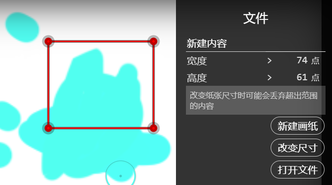
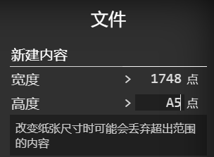
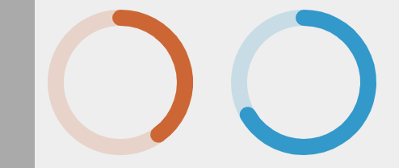

# 文件操作

Skeeetch支持一系列对图像文件的操作。图像文件操作主要通过**文件**菜单。

## 新建纸张

在**文件**菜单中**新建内容**项目下有**新建画纸**按钮。点击它将会清空当前所有内容并新建一张白色背景的空白纸张。原有的内容会被保存到库中。

在上方的输入框中可以调整当前画纸的宽度和高度（像素），并应用到新画纸。注意：新建画纸会清空所有历史记录！

点击宽度高度输入框或调整其数值，会出现红色的矩形选择框示意新的大小。可以拖动四角的把手或四个边框来调整宽度和高度。

> 注：尺寸选择框和功能键的组合
>
> | 组合功能键 | 拖动角部把手 | 拖动边框 |
> | ---------- | ------------ | -------- |
> | 无         | 自由变换     | 自由变换 |
> | Shift      | 等比缩放     | 平移     |
> | Ctrl       | 平移         | 平移     |
> | Alt        | 自由变换     | 自由变换 |

也可以在宽度、高度框中输入标准纸张代号，如A4、B5、32k（32开）等。新建的纸张分辨率将会是300ppi。

> 输入标准纸张代号时，宽度处输入得到横向的纸，高度处输入得到纵向的纸。如上图在高度框中输入`a5`将得到一张300ppi的纵向A5尺寸的画纸。

> Skeeetch当前最大支持**5600x5600**像素的文件，这是合理的范围内进行内存管理/内容渲染所能支持的最大尺寸。Skeeetch使用的技术无法以标准方法管理过大的纸张内容。如果输入标准代号对应的纸张过大，也会提示无法修改为指定纸张的尺寸。
>
> Skeeetch当前最小支持**16x16**像素的文件，这是考虑画布缩放范围的结果。

新建画纸的同时，之前的内容也会在**库**中保存。

编辑标题栏中央的画布标题（默认为Skeeetch）可以更改当前纸张的**文件名**。

## 改变尺寸（裁剪、扩展画纸）

在将画纸宽度和高度调整为目标尺寸数值后，也可以点击下方的**改变尺寸**按钮来更改画纸尺寸。新画纸与原画纸左上角相同，并保留新画纸范围内的内容。

> 改变画纸尺寸后，超出画纸尺寸的部分可能会被丢弃。Skeeetch对任何超出画纸部分的内容采取尽力而为的策略。如果超出部分内容过多导致可能占用过多系统资源，Skeeetch可能会视情况丢弃这些部分。

如果通过矩形选择框确定尺寸，则改变尺寸相当于基于选择框对原画纸进行裁剪或扩展。

## 置入图片文件

Skeeetch支持常见的`.bmp/.jpg/.png/.tiff`等图片文件的置入。将图片从文件管理器、其他网页、或者其他软件窗口中拖入Skeeetch的画纸即可。也可以通过点击**打开文件**按钮从储存中选择。加载的图片将被显示为一个新图层。

## 打开`.psd`文件

将Photoshop支持的`.psd`文件拖入Skeeetch的画纸即可打开，也可以通过点击**打开文件**按钮从储存中选择文件。打开后将清除所有原有的画纸内容，删除历史记录，并重置画纸尺寸。

> 由于Skeeetch不支持PSD文件中的所有内容，如调整图层、文字图层、HDR内容等，打开时不支持的图层将被清除。今后会设法支持更多种图层类型的…
>
> 如果Skeeetch在打开文件时发现了不支持的文件或图层，试图打开后会在左下角给出“不支持的内容已丢弃”的警告。目前不支持的内容包括但不限于图层效果、文字图层、调整图层、和蒙版等等。

> 如果Skeeetch在加载文件时出现长时间无反应/网页崩溃等情况，可能是因为文件过大而耗尽浏览器资源。（[**!!点此清除所有保存的内容和设置!!**](https://iraka-c.github.io/Skeeetch/index.html?clear=1&reset=1)）。我们将不断优化Skeeetch以争取支持打开更大的文件，但一般而言，Skeeetch支持的文件大小和计算机配置、系统设置、浏览器都有关系。

## 保存在浏览器中

Skeeetch支持将当前工作保存在浏览器中直到下一次打开。默认情况下这些保存是**自动**的。如果你觉得不需要自动保存，或者自动保存拖慢了运行速度，可以将 *文件* > *保存内容* > *自动保存* 选项设置为关闭。

>  自动保存启用时，打开大的`.psd`文件会变得较慢，平均会变慢3倍左右。但是好处是…… 不用每次手动保存了。

关闭自动保存后如果需要手动保存，可以点击 *文件* > *保存内容* > *在浏览器中保存* 按钮，或者使用快捷键 `Ctrl+S`。这样下次打开Skeeetch时又会自动加载。

如果Skeeetch发现你在有未保存内容时试图关闭，会在关闭前弹出一条提示。如果希望保存内容可以按下取消按钮，并重新手动保存。

所有文件都保存在文件菜单的**库**中。点击库里的文件就可以打开它并继续编辑。

> 只有打开了一个文件之后才可以重命名它！（在标题栏的文件名处）

## 在浏览器中新建当前画纸的副本

点击 *保存内容* > *另存为副本* 按钮可以在库中新建一个**当前画纸的副本**，并将当前Skeeetch编辑的画纸对象设置为这个副本。所有已经进行的修改（包括当前的历史记录）都将转移到副本中。如果没有开启自动保存，则原画纸不会有内容变化。

这个功能可用于保存不同阶段的工作进度（就像存档点），或者备份已有的内容以便之后再做修改。

## 删除浏览器中保存的文件

库中的每一个文件图标右上角有一个垃圾桶状的删除图标。点中这个图标就可以从库中删除这个文件。

> 试着**点中**它！

另外，当前已打开的文件不可被删除。

## 前台与后台任务

正如你所注意到的，在执行较长的任务时，Skeeetch会在界面左下角显示一个进度条指示当前完成的进度。Skeeetch中有两种任务：前台和后台任务，分别显示为橙色和蓝色进度条。

**前台任务**是当前执行的高优先级任务，如打开文件、导出文件等。执行这些任务时Skeeetch会相当繁忙，几乎无法在画纸上绘制。

**后台任务**是一些低优先级的例行任务，如清理缓存、自动保存等。在有后台任务时你也可以使用Skeeetch。（当然对于过于繁重的后台任务可能也会出现界面卡顿/冻结的现象）

在没有任何前台或后台任务时可以安全地关闭Skeeetch，否则你创作的内容可能无法被完整保存，或者在下次打开Skeeetch时出现错误。如果在试图关闭Skeeetch时仍有任务运行，将弹出提示。

## 导出为图片文件

点击*文件* > *导出为PNG图片* 按钮可以将当前的画纸内容下载为一个带透明度信息的PNG图片文件。

> 目前只支持`.png`文件

## 导出为`.psd`文件

点击*文件* > *保存为PSD文件* 按钮可以将当前的画纸内容下载为一个PSD格式文件，也可以使用快捷键`Ctrl+Shift+S`。Skeeetch将尽力保留图层和图层组的内容及信息，但由于目前只支持低于Photoshop7.0格式的内容保存，一些选项可能无法被完全保留。

## 剪贴板操作

Skeeetch中支持使用`Ctrl+X`（剪切）、`Ctrl+C`（复制）、`Ctrl+V`（粘贴）快捷键。复制的目标或粘贴的来源可以是Skeeetch自己，也可以是其他软件\*。

> \* 其他软件中粘贴可能会遇到透明度无法正确表示（例如全部透明像素变为黑色）的情况

在Skeeetch内部复制粘贴时，Skeeetch会保留图层的设置。如果复制的是图层组，则粘贴时会粘贴为含有这个图层组内容的新图层。如果希望复制图层组内的所有图层结构，请使用[复制图层组](./layers.md#复制图层图层组)功能（按钮）。

如果试图进行剪贴时图层已被锁定，则图层将仅被复制。

此外，`Ctrl+Space+V`快捷键将**粘贴并替换**当前图层（不支持图层组）的内容。

