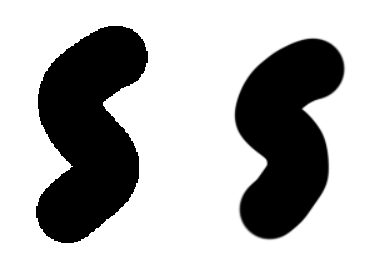
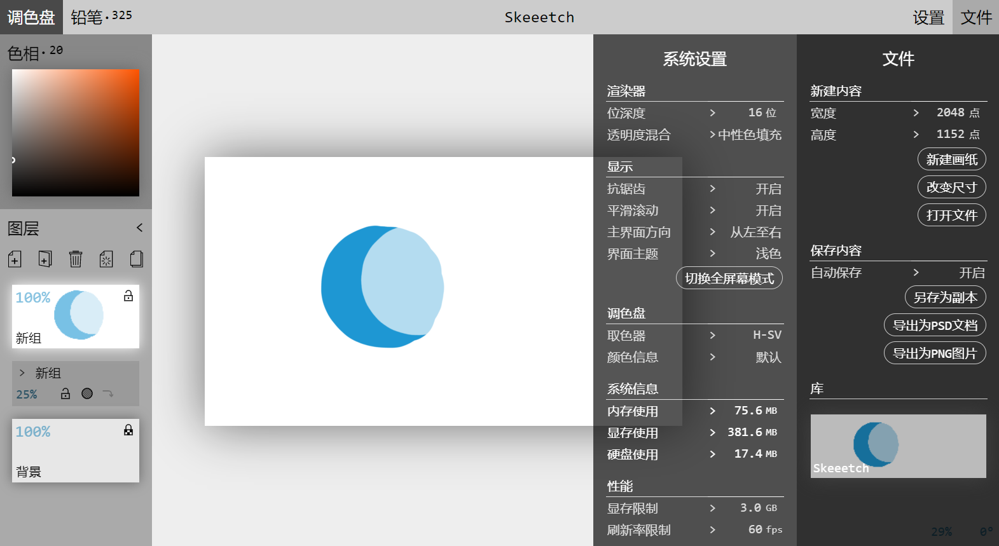

# 画纸和系统

这一章讲述关于画纸和系统设置的操作。针对标题栏的**设置**按钮和菜单。

菜单中大部分设置将会自动保存。

## 画纸操作

### 绘制

在画纸上用鼠标左键/触摸/数位笔等点击并拖动来绘制图形。详见[笔刷帮助](./brush.md)章节。

 ### 取色

在画纸上用右键或Alt加左键点击来设置[调色盘](./palette.md)颜色为当前位置的颜色。取色时光标将变为十字。取色来源为整个画布。

### 调整画布位置

改变右下角的缩放数值和旋转角度数值，就可以调节画布的**缩放**和**旋转**。缩放数值和旋转数值可以通过键盘输入、使用鼠标左右拖动、或者在数值上使用滚轮。

> 按住Shift键拖动或滚动则会调整缩放和旋转为较为规则的值。

画布的**缩放**也可以直接用鼠标滚轮在画布上滚动来改变。在有触摸板的设备上，使用双指上下拖动有类似的效果。

按下Shift键并用鼠标左键拖动可以**平移**整个画布。此时光标会变为十字箭头状。也可以通过按下Ctrl键（垂直）并滚动来平移画布。在有触摸板的设备上，按下Ctrl键并使用双指拖动有类似的效果。

按下Shift键滚动滚轮可以旋转画布。在有触摸板的设备上，按下Shift键并使用双指上下拖动有类似的效果。画布的**旋转**也可以使用Shift+右键拖动来调节。在旋转到接近水平/垂直的时候会自动吸附到水平/垂直角度。

如果想**恢复**默认的画布位置，点击右下角的`[•]`按钮。

点击右下角的`⇆`按钮可以**水平翻转**画布的显示。注意这个按钮只改变画布的显示效果，并不改变图像的内容。按钮会在画布已翻转时高亮为红色。

### 平移当前图层·图层组

在选定一个图层或图层组时，按下Ctrl键并拖动可以调整这个图层或图层组在画纸上的位置。拖动时光标会变成小箭头状。

注意：如果一个图层或图层组所在的图层组透明度被锁定，或者一个图层组有内容不可见或者透明度被锁定。都无法平移当前图层或图层组。

> 将来（？）会支持更多种类的图层形变

### 撤销和重做

Skeeetch在绘制过程中会记录操作历史。在右下角的面板中可以通过单击`<<`或`>>`来回到上一步/下一步的状态。也可以使用快捷键`Ctrl+z`进行撤销，以及`Ctrl+Shift+z`或者`Ctrl+y`进行重做。

> 过于久远的历史会被丢弃。具体历史记录的数量与系统的内存设置有关。

## 系统设置

Skeeetch的系统设置可以在**设置**菜单中调节。以下项目按从上到下的顺序介绍相应设置内容。

### 位深度

位深度指在渲染的时候用多少比特来储存一个像素的一个颜色通道。目前可用的设置为8位（非负整数）、16位（半精度浮点）、或32位（单精度浮点）。位深度越高则渲染越精确，不容易出现伪色/杂色/画笔波纹等，但也意味着Skeeetch运行时占用的内存和显存越多。对于需要精确控制色彩表现的任务，推荐使用32位深度。

### 透明度混合

指定全局的图层透明度混合方法。详见[图层说明](./layers.md#混合模式)。

### 抗锯齿

抗锯齿对画纸的显示和笔刷设置均有效。关闭抗锯齿时，笔刷和画布的渲染是点对点完成的。在缩放画纸或者使用硬边缘笔刷对时候将导致线条的边缘出现可见的锯齿（左）。

打开抗锯齿后绘制（右），Skeeetch将试图在渲染时通过插值的方式来降低这些像素锯齿对观感的干扰。注意如果希望渲染像素画，或者操作较小的画纸，打开抗锯齿反而会使得边缘模糊。

### 平滑滚动

Skeeetch在调整画纸位置的时候会启用平滑的过渡动画。如果你讨厌这种慢吞吞的过渡效果，或者过渡动画导致了Skeeetch的卡顿，那么将**平滑滚动**设置为关将停用这些过渡效果。

### 界面主题

Skeeetch内置了两套主题：浅色和深色。可以根据自己的喜好切换相应的主题。

 

> 深色主题（左）和浅色主题（右）

### 切换全屏幕显示

点击**切换全屏幕显示**按钮可让当前Skeeetch页面在全屏幕/窗口显示之间切换。你也可以使用浏览器自带的全屏显示快捷键。

> 不是所有浏览器都支持全屏幕显示

## 其他系统设置

### 其他显示设置

按`Ctrl+Shift+K`调出其他显示设置菜单

#### 主界面方向

你可以通过切换**主界面方向**选项来设置将图层列表和菜单栏放置在左边还是右边。

#### 字体

你可以通过切换**字体**选项来设置系统字体为“等宽”或是“非衬线”（黑体）。

### 调色盘设置

详见[调色盘帮助](./palette.md)。

### 语言

目前并没有设置更改语言选项。可以通过添加url的lang参数来切换语言。

https://iraka-c.github.io/Skeeetch/gl/index.html?lang=en 英文版（未完善）

https://iraka-c.github.io/Skeeetch/gl/index.html?lang=zh 中文版

> 其他语言？看有没有人愿意翻译和检查咯。详见开发者。

## 性能

### 显存限制

这里可以调节允许Skeeetch使用多少显存（大致）。

Skeeetch至少需要1~2GB的显存来正常工作。查看你的计算机显卡配置和日常使用情况来调节显存的限制量。

注意：这个设置不可以使用拖动或鼠标滚轮来调节！请使用键盘输入。

### 刷新率限制

这里可以调节Skeeetch允许的最高刷新率（帧率）。

较低的刷新率可以减少Skeeetch的计算和资源消耗，但也可能造成肉眼可见的闪烁。这里刷新率指的是每秒**界面刷新**的次数，和渲染器以及笔刷的绘制效果无关。

### 开发者选项

详见开发者（？）

**绘制图层边缘**

绘制当前图层内容占用的GLTexture和记录的有效内容的边缘

### 系统信息

这一栏将显示Skeeetch运行环境的一些信息。

**内存使用**项目显示Skeeetch的内存用量。这些占用主要是历史记录和已缓存的图层信息。

**显存使用**项目显示Skeeetch的显存用量。显存主要由Skeeetch的渲染器占用。

**硬盘使用**项目显示Skeeetch的硬盘用量。这些空间主要用于自动保存的工作区内容。

以上的存储空间使用为Skeeetch估计的结果。由于操作系统/浏览器/显卡驱动的空间分配策略不同，可能出现显示的用量和实际占用量不一致，或者无法读取到相关参数的情况。

Skeeetch默认支持4G的内存和显存。

## 系统重置

有时Skeeetch出现过于严重的问题可能会需要重置。按`Ctrl+Shift+Alt+Enter`快捷键呼出重置菜单，并遵循相应提示即可。

重置后Skeeetch会在设置菜单的任务报告中显示重新载入提示，此时Skeeetch中任何内容都不会被保存。**点击任务报告中的提示**以重新打开新的工作区。