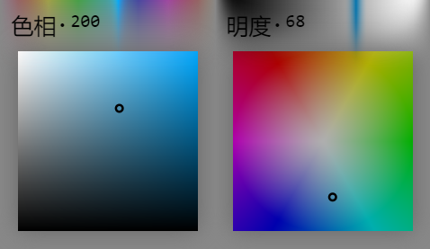
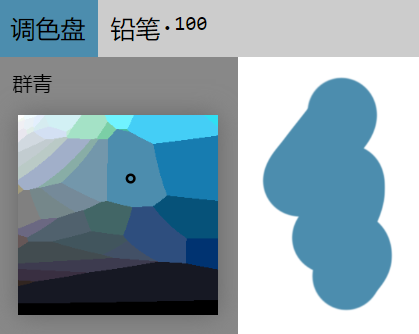

# 调色盘

调色盘是Skeeetch中进行颜色管理的部件。它位于左侧图层栏的上方，可以通过顶部的**调色盘**按钮控制展开和折叠。

调色盘分为两个部分：顶部的滑块和颜色信息部分、以及下方的颜色选择器部分。将光标移动至颜色信息部分时，顶部滑块才会显示。

在图层菜单折叠时，调色盘将显示为小号的选择器。

## 调色盘类型

目前Skeeetch支持两种调色盘：H-SV（色相·饱和度明度）和V-HS（明度·色相饱和度）选择器。可以在*设置* > *调色盘* > *取色器* 按钮上点击以改变调色盘类型。

> 同一颜色在H-SV（左）和V-HS（右）取色器下

H-SV选择器中，顶部滑块是色相，而颜色选择器控制饱和度（水平）和明度（垂直）。V-HS选择器中，顶部滑块是明度，而颜色选择器控制饱和度（至中心）和色相（环绕）。在滑块或选择器上点击并拖动光标可以调整相应的数值。

选取颜色时，调色盘按钮将变为所选的颜色。

在调整颜色时，顶部的颜色信息处会显示一个当前**所选颜色的信息**。默认的信息是色相数值（H-SV）或明度数值（V-HS）。点击*设置* > *调色盘* > *颜色信息* 按钮可以切换不同的颜色信息类型，同时选择器中会显示该信息颜色范围中与当前颜色最接近的颜色。

* Web安全色：显示当前颜色的十六进制表示
* Web颜色名：Web中已命名的颜色实体
* 潘通色卡：潘通（Pantone）标准色卡中对应的色号
* 颜色名：当前语言中命名的颜色

> 启用**颜色名**信息时的调色盘

## 调色盘取色

由于在**颜色信息**非默认的情况下，选择器显示的是最接近颜色的信息，这可能导致当前实际颜色与最接近颜色不同。如果要精确指定颜色为其最接近颜色，可以按住Alt键并在选择器相应颜色上单击以设置为该颜色。取色时光标会变为十字形。

## 画纸取色

详见[画纸操作](./system.md)