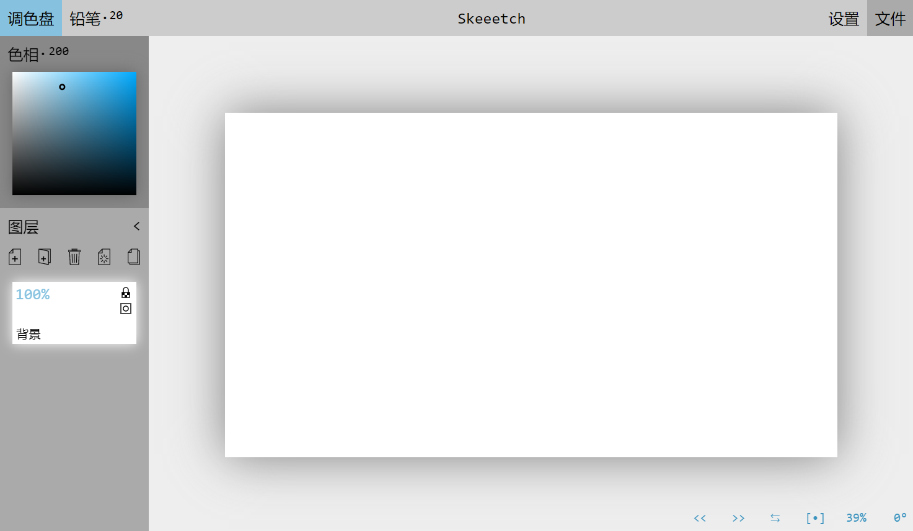

# Skeeetch使用说明

Skeeetch 是一个基于Web平台的绘图工具，小巧而功能强大，完全开源免费。

无需下载，在浏览器中即开即用！

### [**> 打开Skeeetch <**](https://iraka-c.github.io/Skeeetch/index.html?lang=zh)

你可以在浏览器中**收藏Skeeetch**以便日后再次使用。

有任何希望交流或疑问的也可以加QQ群 **Skeeetch互帮互助(813830345)**

当前版本：`Ver. 20210119`

-----

Skeeetch支持许多常见的绘画软件操作，包括：

* 带压感的多种常用画笔以及自定义画笔
* 完善的图层和图层组管理
* 内容的自动保存
* `.png`和Photoshop的`.psd`文件格式导入导出
* ……以及更多！

## 简介目录

* [首次使用](#首次打开界面)
* [基本操作](#基本操作)
* [常见问题](#常见问题)
* [**详细帮助文档**](./manual/index.md)
* [详细开发者文档](./dev/index.md)
* [TODOs](#TODOs)
* [声明及许可证](#声明及许可证)

## 首次打开界面

打开画板，可以看到界面分为三个部分：标题栏、图层侧边栏、和画布窗口。

**标题栏**中从左至右依次为调色盘、笔刷、画纸标题、设置、和文件按钮。点击标题可以输入文件名，点击其余按钮则可以展开相应的菜单。

**图层侧边栏**上部为调色盘，下部为图层栏。点击调色盘按钮可以展开/隐藏调色盘，在调色板中点击/拖动可以选取颜色。

图层栏下面的五个按钮分别是新建图层、新建图层组、删除、清空/合并、和复制按钮。剩下的部分用于显示所有的图层。

**画布窗口**中心是可以绘制的画纸区域。此外，左下角用于显示一些帮助信息，右下角则是一些控制按钮，依次为撤销、重做、翻转、还原位置、缩放、旋转按钮。有些按钮只会在鼠标靠近其所在区域时显示。

## 基本操作

### 绘制线条

> 用软边画笔绘制一条S形曲线

在调色盘中选择一个颜色，用鼠标、触摸或数位笔在画纸上画出你想要的曲线。默认状况下光标会变成如图所示的圆形，指示笔尖的区域。

如果因为任何原因无法绘制（如已锁定、图层未显示、图层类型不支持当前笔刷等），光标将变为一个禁止符号🛇。

如果你使用了带有压感的设备如数位板或压感触屏，笔刷的大小或透明度可以根据压感而变化。详细设置参见[笔刷设置](./manual/brush.md)章节。

将鼠标移动至笔刷按钮上会显示所有笔刷，点击相应的笔刷以使用它。此外，如想改变笔刷大小，可以在笔刷按钮上左右**拖动**或者使用鼠标**滚轮**。Skeeetch中*绝大部分*的数字项目上都可以使用这些方式来进行调节。

### 重新开始工作

现在你已经有了一张有内容的画布。试着关掉Skeeetch再重新打开吧，你的内容都**被自动保存**，留在浏览器中。下次打开Skeeetch就可以继续未完成的绘画。详见[自动保存](./manual/pc-files.md#保存在浏览器中)章节。

> 注意：Skeeetch中的内容默认只保存在**浏览器本地磁盘**中，并没有上传网络或与其他软件共享。换句话说，在一个浏览器中保存的内容，无论是换一个浏览器还是通过网络都是*无法访问*的。

### 调整画布位置

改变右下角的缩放数值和旋转角度数值，就可以调节画布的**缩放**和**旋转**。缩放数值和旋转数值调节可以通过键盘输入、使用鼠标左右拖动数值、或者在数值上使用滚轮。

画布的**缩放**也可以直接用鼠标滚轮在画布上滚动来改变。在有触摸板的设备上，使用双指上下拖动有类似的效果。

按下空格键并用鼠标左键拖动可以**平移**整个画布。此时光标会变为十字箭头状。也可以通过按下Ctrl键（垂直）并滚动来平移画布。在有触摸板的设备上，按下Ctrl键并使用双指拖动有类似的效果。

按下Shift键并用鼠标左键拖动可以缩放+旋转画布。在有触摸板的设备上，按下Shift键并使用滚轮或使用双指上下拖动有类似的效果。

点击右下角的`⇆`按钮可以**水平翻转**画布的显示。注意这个按钮只改变画布的显示效果，并不改变图像的内容。按钮会在画布已翻转时高亮。

如果想**恢复**默认的画布位置，点击右下角的`[•]`按钮。

### 增删图层

默认打开Skeeetch时的第一个图层是一个白色的背景图层和一个透明的绘制图层。

点击图层面板按钮**新建**一个图层。你可以在图层名处输入来给新图层**重命名**。

点击某个图层的图标，图层图标会**点亮**指示当前绘制的对象是这个图层。

点击图层面板按钮将当前活动的图层**删除**。

### 取色

用鼠标右键或`Alt`+左键在画布上点击可以将调色盘颜色拾取为当前位置的颜色。取色时光标将变为十字线。取色来源为整个画布。

### 撤销和重做

Skeeetch支持之前操作的撤销和在撤销之后的重做。在右下角的面板中可以通过单击`<<`或`>>`来回到上一步/下一步的状态。也可以使用快捷键`Ctrl+z`进行撤销，以及`Ctrl+Shift+z`或者`Ctrl+y`进行重做。

更多键盘快捷键详见[快捷键和鼠标组合键](./manual/hotkey.md).

### 更多详细帮助

参见完整的[帮助目录](./manual/index.md)

## 常见问题
* [Skeeetch是个网页，意思是我画的东西都传到网上了？](./manual/QA.md#skeeetch是个网页意思是我画的东西都传到网上了)
* [使用了数位板/压感屏幕，笔刷却对压力无反应](./manual/QA.md#使用了数位板压感屏幕笔刷却对压力无反应)
* [Skeeetch在绘制时出现色差/杂色](./manual/QA.md#skeeetch在绘制时出现色差杂色)
* [我的Skeeetch在运行的时候很卡顿](./manual/QA.md#我的skeeetch在运行的时候很卡顿)
* [为什么Skeeetch占用的内存和显存这么多](./manual/QA.md#为什么skeeetch占用的内存和显存这么多)
* [我的Skeeetch没有反应了/无法完整启动](./manual/QA.md#我的skeeetch没有反应了无法完整启动)
* [Skeeetch相比Photoshop、CSP、SketchBook、SAI、Krita等绘画软件有什么优势吗](./manual/QA.md#skeeetch相比photoshopcspsketchbooksaikrita等绘画软件有什么优势吗)
* [我可以多开Skeeetch标签页或者窗口吗](./manual/QA.md#我可以多开skeeetch标签页或者窗口吗)
* [我觉得这个破应用某个地方会出Bug，或者要是有某某功能就好了](./manual/QA.md#我觉得这个破应用某个地方会出bug或者要是有某某功能就好了)

## TODOs

* 文档内容以及开发者文档补全
* 多语言支持
* <del>多点触控支持，触摸板/触屏支持</del> <ins>（我觉得能先支持好单点就不错了）</ins>
* 更多的画笔（模糊画笔、油漆桶画笔、复制画笔、自定义画笔等）
* 图层变形，<del>裁切</del>
* 调整图层（曝光对比度，色偏饱和度等），直方图
* 引导线和透视引导线

计划路线：<del>颜色转透明度</del> => 重写快捷键系统 => 重写画笔(vertex shader texture)/涂抹画笔(path speed) => 模糊/油漆桶 => <del>画布裁切</del>(dragger layer) => 图层变形(homographic shader) => 自定义画笔 => 调整图层(Lab space) => 直方图 => 透视引导线

> 删除线标记的内容已完成。

## 声明及许可证

Skeeetch 基于 *Apache License 2.0* 许可证发布。*Apache License 2.0* 许可证适用于Skeeetch的所有代码和界面资源，但不包含用户的操作以及用户基于Skeeetch所创作的内容及作品。

Skeeetch仅提供一个基于Web的操作界面以及相关的配套资源，并不对用户因使用Skeeetch造成的一切损失，包括财产的损失和资料的丢失负责。（养成备份的习惯还是不错的！）

