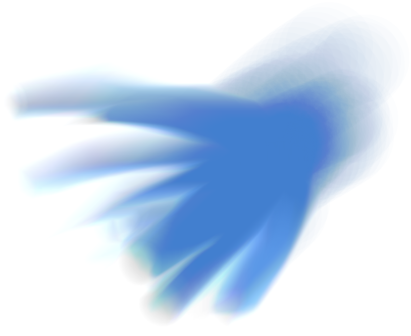

# Skeeetch - WebGL 版本

Skeeetch 是一个基于Web平台的绘图工具，小巧而功能强大，完全开源免费。

Skeeetch支持许多常见的绘画软件操作，包括：

* 带透明度的画板，画笔，和取色器控制
* 带压感的多种常用画笔
* 图层和图层组管理
* 历史记录
* 常见图片格式和Photoshop的`.psd`格式文件导入导出

**无需下载：**在浏览器中即开即用。

### [**使用最新版的Skeeetch!**](https://iraka-c.github.io/Skeeetch/index.html?lang=zh)

你可以在浏览器中收藏Skeeetch以便日后访问。

## 首次打开界面

打开画板，可以看到界面分为三个部分：标题栏、图层侧边栏、和画布窗口。

**标题栏**中从左至右依次为调色盘按钮、笔刷按钮、标题、设置按钮、和文件按钮。点击调色盘按钮可以展开/隐藏调色盘，点击标题可以输入文件名，点击其余按钮则可以展开相应的菜单。

**图层侧边栏**上部为调色盘，下部为图层栏。调色盘为HSV立方体。在调色盘的SV面板中点击可以调节亮度和饱和度，将鼠标移至色相附近会出现彩虹色的色相选择器，点击相应颜色可以改变色相。

图层栏第一排右侧有`<`型按钮，点击可以折叠/展开图层栏。下面的五个按钮分别是新建图层、新建图层组、删除、清空/合并（功能未完善）、和复制按钮（功能未完善）。剩下的部分用于显示所有的图层。你可以将任何一个图层/图层组在图层栏中拖动以改变顺序。

**画布窗口**中心是可以绘制的画布区域。此外，左下角用于显示一些帮助信息，右下角则是一些控制按钮，依次为撤销、重做、翻转、还原位置、缩放、旋转按钮。有些按钮只会在鼠标靠近其所在区域时显示。

## 基本操作

### 绘制线条

> 用软边画笔绘制一条S形曲线

在调色盘中选择一个颜色，用鼠标、触摸或数位笔在画纸上画出你想要的曲线。默认状况下光标会变成如图所示的圆形，指示笔尖的区域。

如果因为任何原因无法绘制（如已锁定、图层未显示、图层类型不支持笔刷等），光标将变为一个禁止符号。

如果你使用了带有压感的设备如数位板或压感触屏，笔刷的大小或透明度可以根据压感而变化。详细设置参见[笔刷设置]()章节（待完善）。

将鼠标移动至笔刷按钮上会显示所有笔刷，点击相应的笔刷以使用它。此外，如想改变笔刷大小，可以在笔刷按钮上左右拖动或者使用鼠标滚轮。Skeeetch中*绝大部分*的数字项目上都可以使用这些方式来进行调节。

### 调整画布位置

改变右下角的缩放数值和旋转角度数值，就可以调节画布的**缩放**和**旋转**。缩放数值和旋转数值可以通过键盘输入、使用鼠标左右拖动、或者在数值上使用滚轮。

画布的**缩放**也可以直接用鼠标滚轮在画布上滚动来改变。在有触摸板的设备上，使用双指上下拖动有类似的效果。

按下Shift键并用鼠标左键拖动可以**平移**整个画布。此时光标会变为十字箭头状。也可以通过按下Shift键（水平）或Ctrl键（垂直）并滚动来平移画布。在有触摸板的设备上，按下Ctrl键并使用双指拖动有类似的效果。

如果想**恢复**默认的画布位置，点击右下角的`[•]`按钮。

点击右下角的`⇆`按钮可以**水平翻转**画布的显示。注意这个按钮只改变画布的显示效果，并不改变图像的内容。按钮会在画布已翻转时高亮为红色。

### 增删图层

默认打开Skeeetch时的第一个图层是一个白色的背景图层。

点击图层面板按钮**新建**一个图层。你可以在图层名处输入来给新图层**重命名**。

点击某个图层的图标，图层图标会**点亮**指示当前绘制的对象是这个图层。

点击图层面板按钮将当前活动的图层**删除**。

### 取色

用鼠标右键或`Alt`+左键在画布上点击可以将调色盘颜色拾取为当前位置的颜色。取色时光标将变为十字。取色来源为整个画布。

### 撤销和重做

Skeeetch支持之前操作的撤销和在撤销之后的重做。在右下角的面板中可以通过单击`<<`或`>>`来回到上一步/下一步的状态。也可以使用快捷键`Ctrl+z`进行撤销，以及`Ctrl+Shift+z`或者`Ctrl+y`进行重做。

**注意：**目前不是所有操作都支持历史记录。

### 导入文件

Skeeetch支持图像文件或`.psd`文件的导入，只需将文件拖入窗口即可。**注意！：**导入PSD文件时，所有之前Skeeetch中的内容将被清空。

如果Skeeetch在加载文件时出现长时间无反应/黑屏等情况，可能是因为文件过大而耗尽浏览器资源。我们将不断优化Skeeetch以争取支持打开更大的文件，但一般而言，Skeeetch支持的文件大小和计算机配置、系统设置、浏览器都有关系。

### 导出文件

Skeeetch支持将当前的画布保存为`.png`图片或`.psd`文件。点击“文件”按钮下的“保存为PNG”或“保存为PSD”即可将画布下载为相应的文件。

编辑标题栏中央的画布标题（默认为Skeeetch）可以更改下载时的**文件名**。

### 更多详细帮助

参见完整的[帮助目录](./index.md)

## 常见问题

**Q：使用了数位板/压感屏幕，笔刷却对压力无反应**

如果你使用了压感设备而笔刷对压感无反应，你可以检查：

* [笔刷设置菜单](./brush.md)中需启用压感并设置最小尺寸/透明度值
* Windows系统和数位板驱动中需启用**Windows Ink**功能
* 尝试重启浏览器或者重新连接压感设备

**Q：Skeeetch在绘制时出现色差/杂色**

> 使用低透明度的**纯蓝色**铅笔和涂抹笔刷在**8位位深度**下进行绘制时显现杂色

A：杂色一般是由于渲染精度不足造成的。较低的位深度在某些情况下会造成色彩信息丢失，将渲染器**位深度**设置为**32位**可以解决这一问题。尽管如此，较高的位深度会增加储存的占用率，导致无法创建尺寸非常大的画纸或者打开大的文件。

**Q：我的Skeeetch在运行的时候很卡顿**

A：卡顿可能是由多种原因造成的。首先我们需要保证一定的硬件配置。Skeeetch为了在网页上实现优质而快速的渲染对配置会有相对较高的要求。我们并未测定保障运行的最低硬件配置，但Skeeetch可以在4GB内存、1.4GHz主频带集成显卡的机器上流畅运行，在Samsung S8手机上的运行也没有问题。测试Skeeetch性能的机器为32GB内存、3.2GHz主频的i7处理器、8GB显存的独立显卡，尽管一般应用并不需要这种配置。

以下这些因素可能造成Skeeetch的卡顿：

* 使用尺寸过大的画布或加载大尺寸文件：尺寸过大的画布将显著增加Skeeetch的渲染负担。
* 在浏览器中打开了过多的窗口：这些窗口会共用浏览器的资源，可能造成Skeeetch计算资源的不足。
* 使用了旧版本的浏览器/非标准浏览器：某些浏览器对最新的Web内容支持可能不够完善，导致了速度低下，或者界面显示/功能的异常。Skeeetch在新版Chrome/Firefox/Edge/Safari下的速度测试是令人满意的。
* 系统中运行的软件过多：和浏览器中的窗口一样，其他软件也可能挤占Skeeetch的运行资源。

由于Skeeetch是基于网页的应用，其速度和系统资源占用不可能像系统上安装的软件一样理想。保证在更多平台上流畅运行是我们的一大目标。

如果是画布尺寸调整时的卡顿，可以通过 *设置菜单* > *显示* > *过渡动画* > *关闭* 来关闭动画效果以缓解卡顿。

**Q：为什么Skeeetch占用的内存和显存这么多**

A：我们在制作Skeeetch时以运行速度和渲染效果为优先考虑，因此大量使用了内存或显存作为缓存，而且并未使用任何内存压缩技术。在图层数量较多或画布尺寸较大时可能会出现大量占用系统内存或显存的情况。我们以后也会在保证速度和质量的条件下尽力优化Skeeetch的资源占用，以及测试不同平台上不同浏览器的渲染性能。

在一定需要打开大文件或操作大量图层的情况下，可以降低[渲染位深度]()通过牺牲一定的渲染质量来操作大文件或降低占用。这可能导致杂色或画笔波纹，但你可以根据自己的内容需求来调节这一选项。试试看！

**Q：Skeeetch相比Photoshop、CSP、SketchBook、SAI、Krita等绘画软件有什么优势吗**

A：目前市面上有许多成熟的商业/开源绘画软件。它们提供丰富的功能、完备的界面和流畅的操作体验。Skeeetch并未计划取代这些软件。从理论上来说，要在Web界面获得系统级的应用体验也是极具挑战的。

我们认为Skeeetch的特性在于以下几点：

1. 面向Web环境的界面设计：Skeeetch尽量抛弃臃肿的窗口和庞杂的操作按钮，仅保留绘画所需要的最核心的功能，并利用Web界面用户友好的特性将它们直观地展示出来。当然这并不意味着Skeeetch仅仅是一个“低配”版本的绘画软件代替品。我们会在保持界面设计理念的基础上，努力使功能和可用性向其他成熟的绘画软件看齐。

2. 基于Web App的操作流程：将应用和网络的特性结合起来也是我们的一个目标。我们希望未来的绘画软件应该是基于云的：在任何地方打开，在任何地方保存。绘画的工作和文件的管理应当都可以在浏览器中进行而无需关心具体的操作系统或硬件设备。当然，目前Skeeetch还没有完善这样的功能，但这是Skeeetch之后的发展目标。

3. 精细的渲染模型：Skeeetch的内部工作逻辑设计一直是以优化速度体验和渲染精细度优先的，为此我们选择了WebGL技术，开发了一些新的算法来适配Web端存在的一些问题。Skeeetch支持每通道最大32位（测试中未开放）的渲染模式以保证颜色的精确还原，虽然这无疑会加重系统和硬件的负担，但为了实现无伪影无色差的色彩还原，我们认为这是值得的。

4. 开发者友好：Skeeetch是一个完全开源的项目。代码逻辑完整，并且都配有良好的注释。这非常适合进行二次开发，如添加功能、增删组件、或者只是在你的网页中引用一下。我们会不断完善开发者文档以方便更多需要一个Web画板作为开发基础的人进行更多的尝试与探索。

   > 至少是这么想的。那什么时候补全开发者文档？Yay~

**Q：我觉得这个破应用某个地方会出Bug，或者要是有某某功能就好了**

A：Skeeetch开发者**靠天吃饭**，所以不一定能回应所有需求。但如果您发现了任何Bug或者有改进意见，欢迎在[GitHub Issues](https://github.com/Iraka-C/Skeeetch/issues)提出问题和建议。

## TODOs

* 更多快捷键
* 文件的本地缓存
* 文件的在线储存
* 剪贴板支持
* 图层蒙版
* 内存/显存占用优化和运行速度优化
* 文档内容以及开发者文档补全
* 多语言支持
* 混合模式补全
* 更多的画笔（模糊画笔、自定义笔刷等）
* 图层变形功能