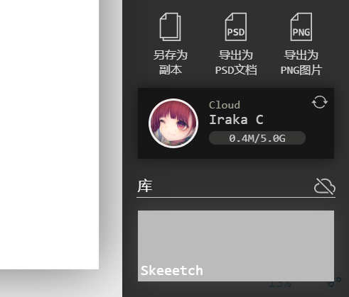

# 20210219版本更新

## 云储存功能

新增了对云储存和同步功能的支持。（目前仅支持[OneDrive](https://onedrive.live.com/)，今后会做更多服务的适配）

云储存使得Skeeetch的画纸不仅限于一个浏览器或电脑上使用，也无需导出画纸：只需要登录账户并点击同步，就可以在任何电脑和浏览器上继续创作了。

使用方法参见[云储存说明](../manual/cloud.md)。

## 修正少量菜单外观

有些菜单项目在一定分辨率下会出现意外的换行或遮挡。本次更新修正了一些外观上的问题。